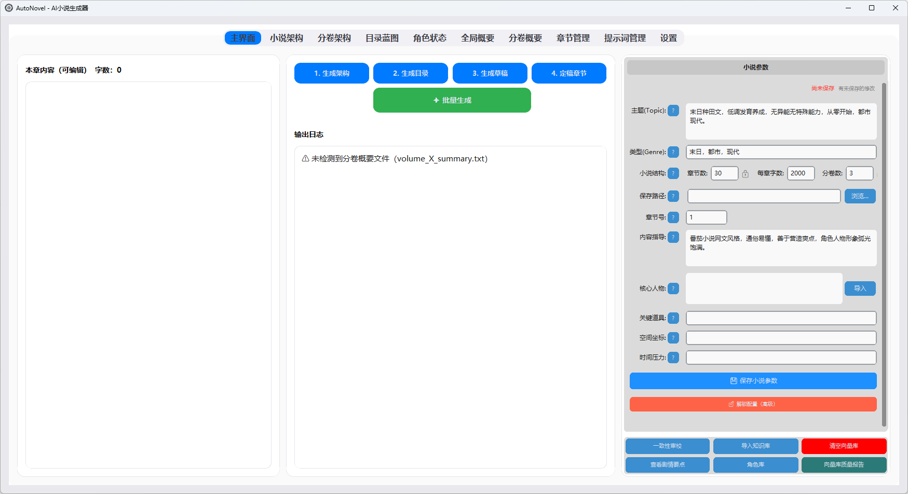

# AutoNovel - 智能小说生成工具

<div align="center">


**基于大语言模型的全流程小说创作平台**

[](https://python.org)
[](LICENSE)
[](https://github.com/TomSchimansky/CustomTkinter)

*一款专为长篇小说创作设计的智能工具，支持多卷架构、剧情一致性管理和全流程自动化生成*

</div>

---

## 项目亮点

<div align="center">

| 核心特性 | 详细说明 |
|----------------|-----------------|
| **双创作模式** | 灵感模式（从主题生成）+ 构思模式（基于已有故事大纲），满足不同创作需求 |
| **章节优化三方案** | Plan A 伏笔注入 + Plan B 摘要缓存 + Plan C 批评家重写，按需组合提升质量 |
| **分卷管理模式** | 支持多卷长篇小说，独立架构规划，卷间摘要传递，完美适配网文创作需求 |
| **剧情要点管理** | ABC三级伏笔分类，智能压缩机制，确保长篇小说剧情连贯不遗忘 |
| **提示词管理系统** | 模块化提示词配置，支持自定义编辑，满足不同创作风格需求 |
| **增强向量检索** | 跨卷语义检索，关键词触发历史内容，保障百万字小说前后一致 |
| **现代化GUI界面** | iOS风格设计，简约美观，全流程可视化操作 |
| **多LLM模型支持** | OpenAI/Claude/Gemini/DeepSeek等主流大模型，按需分配不同任务 |
| **实时进度跟踪** | 详细日志显示，生成进度可视化，支持断点续写 |
| **一致性智能校验** | 自动检测角色设定冲突、剧情逻辑矛盾，提升作品质量 |

</div>

---

## 界面预览

<div align="center">



*AutoNovel 主界面 - 简约美观的全流程创作工作台*

</div>

---

## 致谢与说明

本项目基于 [YILING0013/AI_NovelGenerator](https://github.com/YILING0013/AI_NovelGenerator) 进行大幅改进和重构。

**感谢原作者的开源贡献！** 原项目为自动小说生成提供了优秀的基础架构。

由于个人有较多功能改进想法，且原作者目前较为繁忙暂时无法维护，因此创建了这个改进版本，在原有基础上新增了：
- **双创作模式** - 灵感模式 + 构思模式
- **章节优化三方案** - Plan A/B/C 多策略优化
- **分卷管理系统** - 支持多卷长篇创作
- **剧情要点管理** - ABC分级伏笔管理
- **提示词管理** - 模块化可自定义
- **iOS风格界面** - 现代化UI体验
- **增强向量检索** - 跨卷语义检索
- **进度可视化** - 实时状态追踪

---

## 目录导航

- [项目亮点](#项目亮点)
- [致谢与说明](#致谢与说明)
- [快速开始](#快速开始)
- [项目架构](#项目架构)
- [核心功能](#核心功能)
  - [双创作模式](#双创作模式)
  - [章节优化三方案](#章节优化三方案)
  - [分卷管理模式](#分卷管理模式)
  - [剧情要点管理](#剧情要点管理)
  - [提示词管理系统](#提示词管理系统)
  - [增强向量检索](#增强向量检索)
- [配置指南](#配置指南)
- [使用教程](#使用教程)
- [开发指南](#开发指南)
- [常见问题](#常见问题)
- [许可证](#许可证)

---

## 快速开始

### 环境要求
- **Python 3.9+** (推荐 3.10-3.12)
- **pip** 包管理器
- **API密钥**: OpenAI、Claude、Gemini、DeepSeek 等任一服务

### 安装步骤

1. **克隆项目**
   ```bash
   git clone https://github.com/FredericMN/AutoNovel
   cd AutoNovel
   ```

2. **安装依赖**
   ```bash
   # 推荐使用虚拟环境
   python -m venv venv
   source venv/bin/activate  # Linux/Mac
   # 或 venv\Scripts\activate  # Windows

   pip install -r requirements.txt
   ```

3. **配置API密钥**
   ```bash
   # 复制配置模板
   cp config.example.json config.json

   # 编辑 config.json，填入你的 API 密钥
   ```

4. **启动应用**
   ```bash
   python main.py

   # Windows 用户也可使用启动脚本
   run_gui.bat
   ```

### 第一次运行
1. 在设置页签中配置你的 LLM 和 Embedding 服务
2. **选择创作模式**：灵感模式（输入主题）或构思模式（输入故事大纲）
3. 设置小说基本信息（类型、章节数等）
4. 选择保存目录
5. 开始创作你的第一部智能小说！

---

## 项目架构

```
AutoNovel/
├── core/                        # 核心基础组件
│   ├── adapters/                # LLM/Embedding 适配器
│   │   ├── llm_adapters.py      # 多模型统一接口
│   │   └── embedding_adapters.py # 向量模型适配
│   ├── config/                  # 配置管理
│   │   └── config_manager.py    # 配置加载/保存/验证
│   ├── prompting/               # 提示词管理
│   │   ├── prompt_definitions.py # 提示词定义（含双模式提示词）
│   │   ├── prompt_manager.py    # 提示词管理器
│   │   └── prompt_manager_helper.py # 管理辅助工具
│   ├── consistency/             # 一致性校验
│   │   └── consistency_checker.py # 剧情逻辑检查
│   └── utils/                   # 通用工具
│       ├── file_utils.py        # 文件操作
│       ├── volume_utils.py      # 分卷处理
│       ├── error_utils.py       # 错误处理工具
│       └── chapter_directory_parser.py # 目录解析
├── novel_generator/             # 小说生成核心
│   ├── architecture.py          # 世界观架构生成（支持双创作模式）
│   ├── blueprint.py             # 章节蓝图规划
│   ├── chapter.py               # 章节内容生成（含Plan A/B/C优化）
│   ├── common.py                # 通用生成逻辑
│   ├── finalization.py          # 章节定稿处理
│   ├── knowledge.py             # 知识库集成
│   └── vectorstore_utils.py     # 向量检索引擎
├── ui/                          # 用户界面
│   ├── main_window.py           # 主窗口 (iOS风格)
│   ├── generation_handlers.py   # 生成逻辑处理
│   ├── config_tab.py            # 配置页签
│   ├── main_tab.py              # 主操作界面
│   ├── novel_params_tab.py      # 小说参数（含创作模式切换）
│   ├── setting_tab.py           # 小说设定编辑
│   ├── volume_architecture_tab.py # 分卷架构管理
│   ├── directory_tab.py         # 目录蓝图管理
│   ├── character_tab.py         # 角色状态追踪
│   ├── summary_tab.py           # 全局摘要管理
│   ├── volume_summary_tab.py    # 分卷摘要管理
│   ├── chapters_tab.py          # 章节内容管理
│   ├── prompt_manager_tab.py    # 提示词管理界面
│   ├── settings_tab.py          # 应用设置
│   ├── ios_theme.py             # iOS主题配置
│   └── ios_theme_helper.py      # 主题应用工具
├── custom_prompts/              # 自定义提示词库
│   ├── core_seed_prompt.txt     # 核心种子（灵感模式）
│   ├── user_concept_to_core_seed_prompt.txt  # 构思提炼（构思模式）
│   ├── concept_character_dynamics_prompt.txt # 构思角色动力学
│   ├── concept_world_building_prompt.txt     # 构思世界观
│   ├── critique_prompt.txt      # 批评家提示词（Plan C）
│   ├── refine_prompt.txt        # 重写提示词（Plan C）
│   ├── single_chapter_summary_prompt.txt     # 单章摘要（Plan B）
│   └── ...                      # 其他提示词模板
├── scripts/                     # 维护脚本
├── assets/                      # 静态资源
├── prompts_config.json          # 提示词模块配置
└── packaging/                   # 打包配置
```

---

## 核心功能

### 双创作模式

AutoNovel 提供两种创作起点，满足不同创作者的需求：

#### 灵感模式（从零开始）
- **适用场景**: 只有一个模糊的想法或主题
- **输入内容**: 主题（如"末日求生"）+ 类型（如"科幻"）
- **生成流程**: 系统自动生成核心种子 → 角色 → 世界观 → 剧情架构

#### 构思模式（基于大纲）
- **适用场景**: 已有故事构思或详细大纲
- **输入内容**: 用户已有的故事构思（可以是简要大纲或详细设定）
- **生成流程**: 从用户构思中提炼核心种子 → 补充角色设定 → 完善世界观 → 生成剧情架构
- **优势**: 保留用户原有创意，AI 负责补充和完善

#### 模式切换
在主界面的"小说参数"区域，通过分段按钮即可切换创作模式：
- **灵感模式**: 显示"主题"输入框
- **构思模式**: 显示"故事构思"输入框（支持多行文本）

### 章节优化三方案

AutoNovel 提供三种可组合的章节质量优化策略：

#### Plan A - 伏笔注入
- **原理**: 从 `plot_arcs.txt` 提取 A级(主线) 和 B级(支线) 未解决伏笔，注入生成提示词
- **效果**: 确保新章节呼应前文伏笔，剧情连贯
- **成本**: 无额外 API 调用
- **默认状态**: 启用

#### Plan B - 摘要缓存
- **原理**: 定稿时生成单章摘要（`chapter_X_summary.txt`），后续章节优先读取摘要而非全文
- **效果**: 大幅减少 Token 消耗，支持更长篇幅
- **成本**: 每章定稿时额外 1 次 API 调用
- **默认状态**: 启用

#### Plan C - 批评家重写
- **原理**:
  1. 批评家模块审阅初稿，指出逻辑和文笔问题
  2. 作家模块根据批评意见重写章节
- **效果**: 显著提升章节质量，减少逻辑漏洞
- **成本**: 每章额外 2 次 API 调用
- **默认状态**: 关闭（可在提示词管理中启用）

#### 方案组合建议
| 场景 | 推荐组合 | 说明 |
|------|---------|------|
| 快速生成 | Plan A | 基础质量，最低成本 |
| 长篇创作 | Plan A + B | 节省 Token，保持连贯 |
| 精品创作 | Plan A + B + C | 最高质量，成本较高 |

### 分卷管理模式

AutoNovel 独有的**分卷管理系统**，专为长篇网文创作设计：

#### 多卷架构支持
- **独立卷架构**: 每卷拥有独立的剧情走向和角色发展
- **卷间传承**: 自动管理前一卷摘要传递到新卷
- **灵活规划**: 支持2-10卷的大型作品规划（主要看AI模型的上下文能力）

#### 卷摘要管理
- **卷总结生成**: 每卷完结时自动生成卷摘要
- **前文传递策略**: 固定传递"上一卷完整摘要 + 本卷累积摘要"
- **卷摘要向量化**: 将卷摘要存入向量库，支持跨卷语义检索

#### 分卷生成流程
1. **分卷架构设计** → `Volume_architecture.txt`
2. **分卷蓝图生成** → 每卷独立的章节规划
3. **章节内容生成** → 自动感知当前卷位置
4. **卷摘要生成** → `volume_X_summary.txt`

### 剧情要点管理

创新的**ABC三级伏笔管理系统**，确保长篇小说前后呼应：

#### ABC分级体系
- **[A级-主线]**: 影响故事核心走向（世界观谜团、主角秘密、最终boss）
- **[B级-支线]**: 影响重要配角或次要情节线（配角背景、势力冲突）
- **[C级-细节]**: 仅影响局部细节（物品来源、小道具、一次性角色）

#### 智能压缩机制
- **定期触发**: 每10章自动压缩过多的伏笔内容
- **分级限制**: A级≤30条，B级≤10条，C级≤3条
- **双版本管理**: 详细版(`plot_arcs.txt`) + 精简版(融入摘要)

#### 定稿流程增强
```
[1/3] 更新前文摘要 → global_summary.txt
[2/3] 更新角色状态 → character_state.txt
[2.5/3] 更新剧情要点（详细版，按ABC级记录） → plot_arcs.txt
[2.6/3] 智能压缩（每10章触发） → plot_arcs.txt（压缩后）
[2.8/3] 提炼伏笔到摘要（精简版，筛选ABC级） → global_summary.txt
[3/3] 插入向量库
```

### 提示词管理系统

**模块化提示词架构**，满足个性化创作需求：

#### 模块分类
- **architecture**: 架构生成
  - 核心种子生成（灵感模式）
  - 构思提炼核心种子（构思模式）
  - 角色动力学 / 构思角色动力学
  - 世界观构建 / 构思世界观构建
  - 三幕式情节、分卷架构
- **blueprint**: 蓝图生成（章节蓝图、分块蓝图、分卷章节蓝图）
- **chapter**: 章节生成
  - 首章草稿、后续章节
  - 批评家审阅【Plan C】
  - 作家重写【Plan C】
  - 单章摘要缓存【Plan B】
- **finalization**: 定稿处理（摘要更新、角色状态、卷总结、剧情要点）
- **helper**: 辅助功能（知识搜索、角色状态创建、全局系统提示词）

#### 灵活配置
- **启用控制**: 通过 `prompts_config.json` 控制模块启用/禁用
- **自定义编辑**: 所有提示词支持在GUI中直接编辑
- **依赖管理**: 自动处理模块间依赖关系
- **变量替换**: 智能变量替换系统

### 增强向量检索

**跨卷语义检索引擎**，保障百万字作品一致性：

#### 多层检索策略
- **当前卷优先**: 检索本卷已生成内容（占大部分结果）
- **前卷补充**: 检索前一卷相关内容（1条）
- **历史卷回溯**: 关键词触发时回溯最多3卷历史内容

#### 关键词触发机制
- **自动检测**: 识别"起源"、"身世"、"预言"等关键词
- **智能扩展**: 自动扩展检索范围到历史卷
- **语义相似**: 基于向量相似度的智能匹配

#### 元数据管理
- **章节标记**: 每个文本块标记章节号和卷号
- **卷摘要索引**: 卷摘要也纳入向量库检索
- **去重机制**: 自动去除重复检索结果

---

## 配置指南

### 基础配置 (config.json)

```json
{
  "llm_configs": {
    "DeepSeek V3": {
      "api_key": "你的API密钥",
      "base_url": "https://api.deepseek.com/v1",
      "model_name": "deepseek-chat",
      "temperature": 0.7,
      "max_tokens": 8192,
      "timeout": 600,
      "interface_format": "OpenAI"
    },
    "GPT-4": {
      "api_key": "你的API密钥",
      "base_url": "https://api.openai.com/v1",
      "model_name": "gpt-4o",
      "temperature": 0.7,
      "max_tokens": 32768,
      "timeout": 600,
      "interface_format": "OpenAI"
    }
  },
  "embedding_configs": {
    "OpenAI": {
      "api_key": "你的API密钥",
      "base_url": "https://api.openai.com/v1",
      "model_name": "text-embedding-ada-002",
      "retrieval_k": 4,
      "interface_format": "OpenAI"
    }
  },
  "choose_configs": {
    "architecture_llm": "GPT-4",
    "chapter_outline_llm": "DeepSeek V3",
    "prompt_draft_llm": "DeepSeek V3",
    "final_chapter_llm": "GPT-4",
    "consistency_review_llm": "DeepSeek V3"
  }
}
```

### 支持的模型

#### LLM 模型
- **OpenAI**: GPT-4, GPT-4o, GPT-3.5-turbo 等
- **Anthropic**: Claude-3.5-sonnet, Claude-3-opus 等
- **Google**: Gemini-2.5-pro, Gemini-1.5-pro 等
- **DeepSeek**: deepseek-chat, deepseek-coder 等
- **本地模型**: 支持 Ollama 等 OpenAI 兼容接口

#### Embedding 模型
- **OpenAI**: text-embedding-ada-002, text-embedding-3-large
- **本地模型**: nomic-embed-text (Ollama), bge-large-zh 等

### 提示词配置 (prompts_config.json)

```json
{
  "modules": {
    "architecture": {
      "core_seed": {
        "enabled": true,
        "required": true,
        "display_name": "核心种子生成",
        "file": "custom_prompts/core_seed_prompt.txt"
      },
      "user_concept_to_core_seed": {
        "enabled": true,
        "required": false,
        "display_name": "构思提炼核心种子",
        "description": "【构思模式】从用户已有故事构思中提炼核心种子"
      }
    },
    "chapter": {
      "critique": {
        "enabled": true,
        "required": false,
        "display_name": "批评家审阅【Plan C】",
        "description": "启用后每章增加2次API调用"
      },
      "refine": {
        "enabled": true,
        "required": false,
        "display_name": "作家重写【Plan C】",
        "dependencies": ["critique"]
      }
    }
  }
}
```

---

## 使用教程

### 基础流程

#### 1. 环境配置
1. **API 配置**: 在"设置"页签中配置你的 LLM 和 Embedding 服务
2. **创作模式选择**: 选择"灵感模式"或"构思模式"
3. **小说设定**: 填写类型、章节数、字数等基本信息
4. **保存路径**: 选择小说文件的保存目录

#### 2. 小说架构设计
1. **点击"Step1. 生成设定"**
   - **灵感模式**: 根据主题生成世界观、角色设定、剧情架构
   - **构思模式**: 从用户构思中提炼并补充完整架构
   - 输出: `Novel_architecture.txt`
   - 支持分卷模式，额外生成: `Volume_architecture.txt`

2. **架构审查与调整**
   - 在"小说架构"页签中查看生成结果
   - 可直接编辑修改架构内容
   - 分卷模式可在"分卷架构"页签中调整各卷设定

#### 3. 章节蓝图规划
1. **点击"Step2. 生成目录"**
   - 根据架构生成所有章节标题和大纲
   - 输出: `Novel_directory.txt`
   - 分卷模式支持分卷章节蓝图生成

2. **目录审查与调整**
   - 在"目录蓝图"页签中查看章节规划
   - 可修改章节标题和大纲内容

#### 4. 章节内容生成
1. **设置生成章节**: 在主界面输入要生成的章节号
2. **本章指导**: 可选填写对本章的特殊要求或剧情指导
3. **点击"Step3. 生成章节草稿"**
   - 自动检索相关历史内容（向量检索）
   - 注入未解决伏笔（Plan A）
   - 生成章节大纲和正文
   - 可选触发批评家-作家优化循环（Plan C）
   - 输出: `chapter_X.txt`, `outline_X.txt`

4. **章节编辑**: 在左侧文本框中查看和编辑生成内容

#### 5. 章节定稿
1. **点击"Step4. 定稿当前章节"**
   - 更新全局摘要: `global_summary.txt`
   - 更新角色状态: `character_state.txt`
   - 更新剧情要点: `plot_arcs.txt`
   - 生成单章摘要（Plan B）: `chapter_X_summary.txt`
   - 存入向量库供后续检索

2. **一致性检查**: 点击"一致性审校"检测潜在的剧情冲突

#### 6. 分卷管理 (可选)
- **卷摘要生成**: 每卷最后一章定稿后自动生成卷摘要
- **卷摘要查看**: 在"分卷概要"页签中查看各卷摘要
- **跨卷检索**: 系统自动处理卷间信息传递

### 高级功能

#### 批量生成
1. **连续生成**: 在主界面设置起始和结束章节号
2. **点击"批量生成并定稿"**: 自动完成多章节的生成和定稿
3. **进度监控**: 实时查看生成进度和日志信息

#### 启用 Plan C 优化
1. **进入"提示词管理"页签**
2. **在"chapter"分类下找到**:
   - "批评家审阅【Plan C】" - 启用
   - "作家重写【Plan C】" - 启用
3. **保存配置**: 系统自动应用，后续章节生成将触发优化循环

#### 提示词自定义
1. **进入"提示词管理"页签**
2. **选择要自定义的模块**: 如"核心种子生成"、"章节草稿"等
3. **编辑提示词内容**: 支持变量替换，如 `{topic}`, `{genre}` 等
4. **保存配置**: 系统自动应用新的提示词

#### 知识库集成
1. **准备知识文档**: 支持 .txt, .docx, .pdf 格式
2. **导入知识库**: 系统自动向量化知识内容
3. **智能检索**: 生成章节时自动检索相关知识

#### 向量检索优化
1. **Embedding 模型选择**: 根据语言特性选择合适的 Embedding 模型
2. **检索参数调整**: 调整 `retrieval_k` 控制检索数量
3. **向量库管理**: 切换 Embedding 模型后需清空 `vectorstore/` 目录

---

## 开发指南

### 开发环境搭建

```bash
# 克隆项目
git clone https://github.com/FredericMN/AutoNovel
cd AutoNovel

# 创建虚拟环境
python -m venv venv
source venv/bin/activate  # Linux/Mac
# 或 venv\Scripts\activate  # Windows

# 安装开发依赖
pip install -r requirements.txt

# 安装开发工具
pip install pytest black flake8
```

### 代码规范

- **编码标准**: 遵循 PEP 8 规范
- **命名约定**:
  - 函数/变量: `snake_case`
  - 类名: `CapWords`
  - 常量: `UPPER_CASE`
- **文档字符串**: 使用中文描述
- **类型注解**: 重要函数添加类型注解

### 项目结构说明

#### core/ 模块
- **adapters/**: LLM 和 Embedding 模型适配器
- **config/**: 配置文件管理和验证
- **prompting/**: 提示词管理系统（含双模式提示词）
- **consistency/**: 剧情一致性检查
- **utils/**: 通用工具函数（含错误处理工具）

#### novel_generator/ 模块
- **architecture.py**: 小说架构生成逻辑（支持灵感/构思双模式）
- **blueprint.py**: 章节蓝图生成，支持分块处理
- **chapter.py**: 章节内容生成，集成 Plan A/B/C 优化
- **common.py**: 通用生成逻辑和辅助函数
- **finalization.py**: 章节定稿，更新摘要和状态
- **vectorstore_utils.py**: 向量库操作和检索

#### ui/ 模块
- **主窗口**: `main_window.py` - 应用主入口
- **参数面板**: `novel_params_tab.py` - 含创作模式切换
- **提示词管理**: `prompt_manager_tab.py` - 模块化提示词配置界面
- **页签管理**: 各功能页签的独立模块
- **主题系统**: `ios_theme.py` - iOS 风格主题配置
- **事件处理**: `generation_handlers.py` - 生成逻辑的 UI 处理

### 添加新功能

#### 添加新的提示词模块
1. 在 `custom_prompts/` 中创建提示词文件
2. 在 `prompts_config.json` 中注册模块
3. 在 `prompt_definitions.py` 中添加默认提示词
4. 在对应的生成模块中调用

#### 添加新的 LLM 适配器
1. 在 `core/adapters/llm_adapters.py` 中继承 `BaseLLMAdapter`
2. 实现 `invoke()` 方法
3. 在 `create_llm_adapter()` 中注册新适配器
4. 更新配置文件模板

#### 添加新的 UI 页签
1. 在 `ui/` 中创建新的页签模块
2. 继承适当的基类并应用 iOS 主题
3. 在 `main_window.py` 中注册页签
4. 在 `generation_handlers.py` 中添加事件处理

### 测试指南

```bash
# 运行手动测试
python tests/manual/test_config_lock.py
python tests/manual/test_prompt_manager.py

# 测试配置加载
python -c "from core.config.config_manager import ConfigManager; print('配置加载测试通过')"

# 测试 UI 启动
python main.py
```

### 打包发布

```bash
# 安装打包工具
pip install pyinstaller

# 使用配置文件打包
pyinstaller packaging/main.spec

# 生成的可执行文件在 dist/ 目录
```

---

## 常见问题

### 配置相关

**Q: 如何配置多个 LLM 服务？**

A: 在 `config.json` 的 `llm_configs` 中添加多个配置，然后在 `choose_configs` 中为不同任务分配不同模型：

```json
{
  "llm_configs": {
    "架构生成": { "model_name": "gpt-4o", ... },
    "内容生成": { "model_name": "deepseek-chat", ... }
  },
  "choose_configs": {
    "architecture_llm": "架构生成",
    "prompt_draft_llm": "内容生成"
  }
}
```

**Q: 如何配置本地 Ollama 服务？**

A: 确保 Ollama 服务运行后，配置如下：

```json
{
  "api_key": "ollama",
  "base_url": "http://localhost:11434/v1",
  "model_name": "llama3:8b",
  "interface_format": "OpenAI"
}
```

### 功能相关

**Q: 灵感模式和构思模式有什么区别？**

A:
- **灵感模式**: 只需提供主题和类型，系统从零开始生成所有设定
- **构思模式**: 用户提供故事大纲或构思，系统在此基础上补充和完善
- **选择建议**: 有明确故事想法用构思模式，只有模糊灵感用灵感模式

**Q: Plan A/B/C 如何选择？**

A:
- **Plan A（伏笔注入）**: 始终建议启用，无额外成本
- **Plan B（摘要缓存）**: 长篇创作建议启用，可大幅节省 Token
- **Plan C（批评家重写）**: 追求高质量时启用，成本较高但效果显著

**Q: 分卷模式和普通模式有什么区别？**

A:
- **普通模式**: 单一长篇小说，全局统一摘要
- **分卷模式**: 支持多卷结构，每卷独立架构和摘要，适合网文创作
- **选择建议**: 超过50章建议使用分卷模式

**Q: 剧情要点管理的 ABC 分级如何使用？**

A:
- **A级**: 影响主线剧情的重要伏笔（如主角身世、世界观谜团）
- **B级**: 影响支线剧情的中等伏笔（如配角背景、势力关系）
- **C级**: 局部细节的小伏笔（如道具来源、一次性角色）

**Q: 向量检索总是检索不到相关内容？**

A: 检查以下几点：
1. Embedding 配置是否正确
2. 是否已经定稿前面的章节（向量库需要定稿才更新）
3. 检索关键词是否匹配（可以在日志中查看检索结果）
4. 尝试增加 `retrieval_k` 参数

### 错误处理

**Q: "Expecting value: line 1 column 1 (char 0)" 错误**

A: 这通常是 API 响应异常，检查：
1. API 密钥是否正确
2. base_url 是否可访问
3. 网络连接是否正常
4. 是否超出 API 调用限额

**Q: "504 Gateway Timeout" 错误**

A: 请求超时，可以：
1. 增加 `timeout` 配置
2. 检查网络稳定性
3. 尝试其他 API 服务
4. 减少单次生成的内容长度

**Q: GUI 页签无法切换**

A: 这可能是主题应用问题：
1. 重启应用
2. 检查 `ios_theme.py` 是否正确加载
3. 确保没有自定义 TabView 的 command 参数

**Q: 章节生成中断怎么办？**

A:
1. 查看 `logs/app.log` 了解具体错误
2. 可以重新运行生成，系统会检测已存在的文件
3. 批量生成支持断点续写

**Q: Plan C 重写后内容变短或质量下降？**

A: 系统内置了校验机制：
1. 重写内容不能比初稿缩水超过 60%
2. 自动检测 LLM 拒绝响应
3. 校验失败时会自动回退到初稿

---

## 许可证

本项目采用 MIT 许可证开源。

### 致谢
- **原作者**: [YILING0013](https://github.com/YILING0013) - 感谢提供优秀的基础架构
- **CustomTkinter**: 现代化的 Python GUI 框架
- **LangChain**: 强大的 LLM 应用开发框架
- **Chroma**: 高效的向量数据库
- **所有贡献者**: 感谢每一位为项目做出贡献的开发者

### 贡献指南
欢迎提交 Issue 和 Pull Request！

1. Fork 本项目
2. 创建功能分支 (`git checkout -b feature/AmazingFeature`)
3. 提交更改 (`git commit -m 'Add some AmazingFeature'`)
4. 推送到分支 (`git push origin feature/AmazingFeature`)
5. 创建 Pull Request

---

<div align="center">

**如果这个项目对你有帮助，请给一个 Star！**

**有问题或建议？欢迎提交 [Issue](https://github.com/FredericMN/AutoNovel/issues)**

---

*用智能工具，创作无限可能*

</div>
