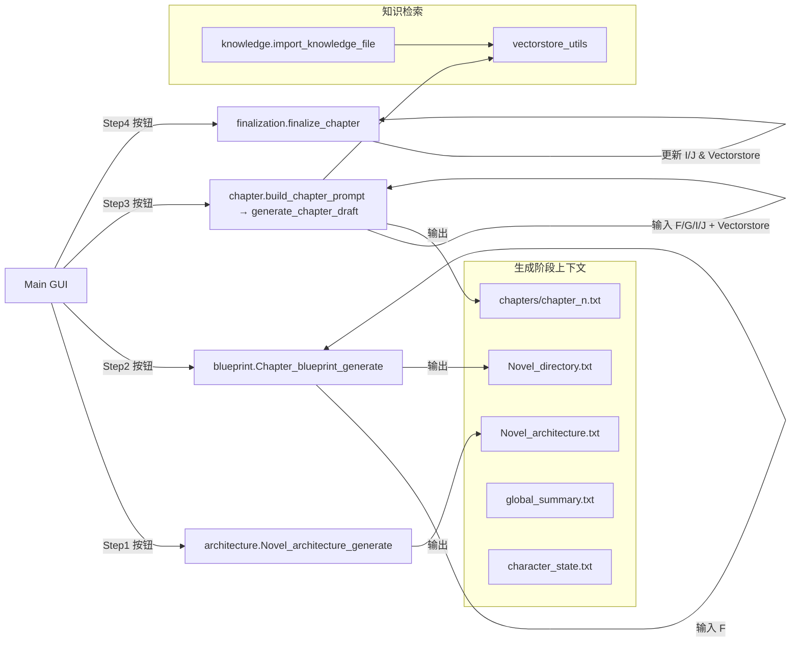
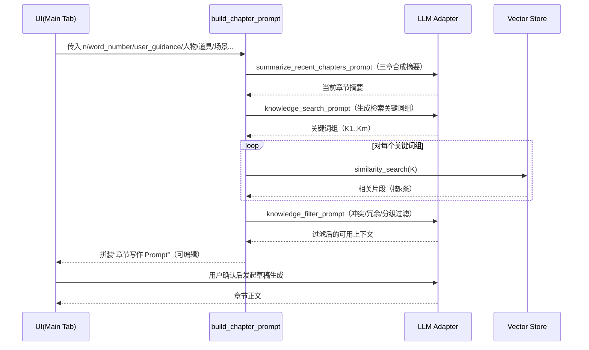
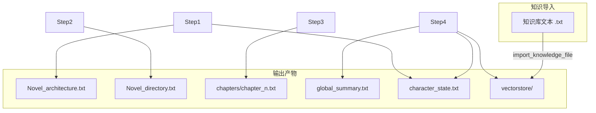

# AI_NovelGenerator 深度解析与改造指南

> 面向魔改/二次开发的技术读本：架构、数据流、交互流程、提示词清单与扩展点

## 1. 项目速览
- 运行入口：`main.py` 启动 CustomTkinter GUI（Windows/macOS/Linux）
- 两大核心域：
  - 生成域：`novel_generator/`（架构/蓝图/章节/定稿/知识库/向量库）
  - 界面域：`ui/`（Tab UI、按钮事件、弹窗、线程、配置选择）
- 关键支撑：
  - LLM 调用：`core/adapters/llm_adapters.py`（OpenAI/DeepSeek/Ollama/Azure/Gemini/硅基流动/Grok…）
  - 向量库：`novel_generator/vectorstore_utils.py`（Chroma + 可插拔 embedding）
  - 提示词库：`core/prompting/prompt_definitions.py`（集中管理全部 Prompt 模板）
  - 配置：`core/config/config_manager.py`（多套 LLM/Embedding 配置 + 测试）

目录简图：
```
novel_generator/
├── architecture.py         # Step1 生成“小说总体架构”
├── blueprint.py            # Step2 生成“章节蓝图/大目录”（支持分块续写）
├── chapter.py              # Step3 构造章节草稿 Prompt（含摘要+向量检索+知识过滤）
├── finalization.py         # Step4 定稿（更新摘要/角色/向量库）与可选扩写
├── knowledge.py            # 导入本地知识库 -> 向量库
├── vectorstore_utils.py    # 向量库的初始化/加载/检索/更新
├── common.py               # 调用清洗、重试、调试日志

ui/
├── main_window.py          # 主窗口、变量初始化、Tab 汇总、通用工具
├── generation_handlers.py  # Step1~4 按钮事件与批量操作
├── main_tab.py             # 左侧编辑/日志 + 右侧工具区布局
├── config_tab.py           # LLM/Embedding/选择器/代理/WebDAV
├── novel_params_tab.py     # 主题/类型/章节数/指导/人物道具场景等
├── directory_tab.py        # Novel_directory.txt 编辑
├── setting_tab.py          # Novel_architecture.txt 编辑
├── summary_tab.py          # global_summary.txt 编辑
├── character_tab.py        # character_state.txt 编辑
├── role_library.py         # 角色库管理 + 从文本抽取角色（LLM）
```

---

## 2. 端到端流程总览



- 用户回环：重复 Step3→Step4 直到完结；任何阶段可在对应 Tab 手动修改产物。
- 日志：所有后台进度与完整 Prompt/Response 会写入 `logs/app.log`，且 `invoke_with_cleaning` 会在终端同步打印（便于调试）。

---

## 3. 四步法详细说明（调用点 + Prompt 模板）

下文对每个功能的调用链、关键文件、提示词与输入字段进行拆解，并标注源码位置（路径:行）。

### 3.1 Step1 生成总体架构（含初始角色状态）
- 入口：`ui/generation_handlers.py:23` → `novel_generator/architecture.py:55`
- 输出：`Novel_architecture.txt`，并基于角色动力学生成初始 `character_state.txt`
- 主要调用链：
  1) `core_seed_prompt` 构建故事核心（雪花法 Step1）
     - 定义：`core/prompting/prompt_definitions.py:161`
     - 关键入参：`topic, genre, number_of_chapters, word_number, user_guidance`
  2) `character_dynamics_prompt` 角色弧光/关系网
     - 定义：`core/prompting/prompt_definitions.py:180`
     - 入参：`core_seed, user_guidance`
  3) `create_character_state_prompt` 由"角色动力学"生成初始角色状态文档
     - 定义：`core/prompting/prompt_definitions.py:379`
     - 调用：`novel_generator/architecture.py:130`
  4) `world_building_prompt` 三维世界观矩阵
     - 定义：`core/prompting/prompt_definitions.py:209`
     - 入参：`core_seed, user_guidance`
  5) `plot_architecture_prompt` 三幕式架构（含关键转折/伏笔回收）
     - 定义：`core/prompting/prompt_definitions.py:237`
     - 入参：`core_seed, character_dynamics, world_building, user_guidance`

- 最终拼装写入：`novel_generator/architecture.py:187` → `Novel_architecture.txt`

提示：`invoke_with_cleaning` 会在控制台打印每个 Prompt 与返回，便于观察模型错误或越界内容（`novel_generator/common.py:41`）。

### 3.2 Step2 生成章节蓝图/大目录（支持断点续写）
- 入口：`ui/generation_handlers.py:79` → `novel_generator/blueprint.py:50`
- 输出：`Novel_directory.txt`
- 规则：自动计算分块大小；若已有部分目录则从下一章续写，仅向模型提供最近 100 章提示避免超长。
- 两种 Prompt：
  - 全量：`chapter_blueprint_prompt`（`core/prompting/prompt_definitions.py:267`）
  - 分块：`chunked_chapter_blueprint_prompt`（`core/prompting/prompt_definitions.py:311`）
- 关键入参：`novel_architecture`（即 Step1 结果）+ `number_of_chapters` + `user_guidance`
- 分块续写逻辑：`novel_generator/blueprint.py:95–132, 150–179`

### 3.3 Step3 生成章节草稿（检索增强 + 摘要 + 可编辑提示词）
- 入口：`ui/generation_handlers.py:125` → 构造 Prompt 弹窗 → 确认后 `novel_generator/chapter.py:520`
- 流程分解：
  1) 读取上下文：
     - 架构：`Novel_architecture.txt`
     - 蓝图：`Novel_directory.txt`（并解析当前章及下一章元数据）
     - 全局摘要：`global_summary.txt`（如有）
     - 角色状态：`character_state.txt`（如有）
  2) 生成"前三章合成摘要"：`summarize_recent_chapters_prompt`（`core/prompting/prompt_definitions.py:10`）
     - 调用：`novel_generator/chapter.py:48–107`
  3) 关键词生成 → 向量检索 → 规则标注 → 过滤：
     - 关键词 Prompt：`knowledge_search_prompt`（`core/prompting/prompt_definitions.py:61`）
     - 检索：`vectorstore_utils.get_relevant_context_from_vector_store`
     - 使用规则标注：`apply_content_rules`（同文件）
     - 过滤 Prompt：`knowledge_filter_prompt`（`core/prompting/prompt_definitions.py:112`）
     - 封装函数：`get_filtered_knowledge_context`（`novel_generator/chapter.py:220`）
  4) 章节写作 Prompt：
     - 第1章：`first_chapter_draft_prompt`（`core/prompting/prompt_definitions.py:493`）
     - 其它章：`next_chapter_draft_prompt`（`core/prompting/prompt_definitions.py:541`）
     - 构造位置：`build_chapter_prompt`（`novel_generator/chapter.py:280+`）
  5) 弹窗可编辑提示词：`ui/generation_handlers.py:167–221`
  6) 真正调用生成：`generate_chapter_draft`（`novel_generator/chapter.py:520`）→ 写入 `chapters/chapter_{n}.txt`

- 章节草稿“检索增强”序列图：


- 可控性：在弹窗里你可以对“章节写作 Prompt”做二次加工（插入角色库片段、加硬性约束、切换风格等），无侵入式魔改入口。

### 3.4 Step4 定稿与向量库更新（可选扩写）
- 入口：`ui/generation_handlers.py:313` → `novel_generator/finalization.py:21`
- 动作：
  1) 更新全局摘要：`summary_prompt`（`core/prompting/prompt_definitions.py:361`）
  2) 更新角色状态：`update_character_state_prompt`（`core/prompting/prompt_definitions.py:430`）
  3) 更新向量库：`vectorstore_utils.update_vector_store`（对本章文本句子分段后入库）
  4) 字数不足可触发"扩写"：`enrich_chapter_text`（内联 Prompt；`novel_generator/finalization.py:120`）

- 一致性审校（可选）：
  - 入口：`ui/generation_handlers.py:399` → `core/consistency/consistency_checker.py`
  - Prompt：`CONSISTENCY_PROMPT`（整合设定/状态/摘要/剧情要点/最新章）

---

## 4. Prompt 参考手册（清单 + 入参）

> 完整模板请直接查看 `core/prompting/prompt_definitions.py` 指定行号。这里列出用途与占位变量，便于替换和魔改。

- `summarize_recent_chapters_prompt`（`core/prompting/prompt_definitions.py:10`）
  - 用途：基于前三章与目录元数据，产出“当前章摘要”。
  - 变量：`combined_text, novel_number, chapter_title, chapter_role, chapter_purpose, suspense_level, foreshadowing, plot_twist_level, chapter_summary, next_*`

- `knowledge_search_prompt`（`core/prompting/prompt_definitions.py:61`）
  - 用途：把章节需求拆成 3–5 组检索关键词（以“·”分隔）。
  - 变量：`chapter_number, chapter_title, characters_involved, key_items, scene_location, chapter_role, chapter_purpose, foreshadowing, short_summary, user_guidance, time_constraint`

- `knowledge_filter_prompt`（`core/prompting/prompt_definitions.py:112`）
  - 用途：对检索片段做冲突检测、去重、分级、重写建议，输出“可直接引用”的上下文。
  - 变量：`retrieved_texts, chapter_info(组装好的要点文本)`

- `core_seed_prompt`（`core/prompting/prompt_definitions.py:161`）
  - 用途：雪花法第一步，单句概括故事核心。
  - 变量：`topic, genre, number_of_chapters, word_number, user_guidance`

- `character_dynamics_prompt`（`core/prompting/prompt_definitions.py:180`）
  - 用途：设计 3–6 个“可发生弧光变化”的核心角色及冲突网络。
  - 变量：`core_seed, user_guidance`

- `world_building_prompt`（`core/prompting/prompt_definitions.py:209`）
  - 用途：物理/社会/隐喻三维世界观矩阵。
  - 变量：`core_seed, user_guidance`

- `plot_architecture_prompt`（`core/prompting/prompt_definitions.py:237`）
  - 用途：三幕式推进，每幕 3 个关键转折 + 伏笔回收方案。
  - 变量：`core_seed, character_dynamics, world_building, user_guidance`

- `chapter_blueprint_prompt`（`core/prompting/prompt_definitions.py:267`） / `chunked_chapter_blueprint_prompt`（`core/prompting/prompt_definitions.py:311`）
  - 用途：输出 n 章目录（节奏/悬念/伏笔/颠覆/一句话概述）。
  - 变量：`novel_architecture, number_of_chapters, chapter_list(分块续写时), user_guidance`

- `summary_prompt`（`core/prompting/prompt_definitions.py:361`）
  - 用途：用新章节更新“全局摘要”。
  - 变量：`chapter_text, global_summary`

- `create_character_state_prompt`（`core/prompting/prompt_definitions.py:379`） / `update_character_state_prompt`（`core/prompting/prompt_definitions.py:430`）
  - 用途：创建/更新 `character_state.txt`，结构统一（物品/能力/状态/关系网/事件）。
  - 变量：`character_dynamics` 或 `chapter_text + old_state`

- `first_chapter_draft_prompt`（`core/prompting/prompt_definitions.py:493`）
  - 用途：第 1 章的正文写作模板。
  - 变量：`novel_number, chapter_* 元数据, word_number, characters_involved, key_items, scene_location, time_constraint, novel_setting, user_guidance`

- `next_chapter_draft_prompt`（`core/prompting/prompt_definitions.py:541`）
  - 用途：第 2+ 章写作模板（包含前文摘要、上一章结尾、角色状态、知识库过滤结果）。
  - 变量：`global_summary, previous_chapter_excerpt, character_state, short_summary, current chapter_* 元数据, next chapter_* 元数据, filtered_context, word_number, user_guidance`

- 角色抽取：`Character_Import_Prompt`（`core/prompting/prompt_definitions.py:626`）
  - 用途：从任意文本抽取“角色状态”结构（用于角色库/临时角色库）。

---

## 5. 数据与产物流



- 产物都写在 GUI 里配置的“保存路径”下；向量库默认保存在 `{保存路径}/vectorstore/`。
- 目录蓝图和章节草稿都支持手动编辑，后续步骤会读取最新版本。

---

## 6. LLM 与 Embedding 适配层

- LLM 入口：`create_llm_adapter(interface_format, base_url, model_name, api_key, ...)`（`core/adapters/llm_adapters.py`）
  - 支持：`DeepSeek/OpenAI/Azure OpenAI/Azure AI/Ollama/ML Studio/Gemini/阿里云百炼/火山引擎/硅基流动/Grok`
  - 重点：`check_base_url` 自动补 `/v1`；Azure 需要特殊 `base_url` 模式（见类注释）。
- Embedding 入口：`create_embedding_adapter(interface_format, api_key, base_url, model_name)`（`core/adapters/embedding_adapters.py`）
  - 支持：`OpenAI/Azure OpenAI/Ollama/LM Studio/Gemini/SiliconFlow`
  - 向量库：`Chroma`，集合名 `novel_collection`，Top-K 可在“Embedding settings”里配置。

魔改建议：
- 新增模型：在 `core/adapters/llm_adapters.py`/`core/adapters/embedding_adapters.py` 增加对应 Adapter 并在工厂函数注册；在 `config.json`/GUI 中增配一条即可无侵入切换。
- 请求级别 Hook：`novel_generator/common.py` 的 `invoke_with_cleaning` 是统一出口，可在此注入观测、裁剪、对齐或重试策略。

---

## 7. GUI 操作与关键事件

- 主面板（Main Functions）：
  - Step1/Step2/Step3/Step4 按钮 → `ui/generation_handlers.py` 对应函数：
    - 生成架构：`generate_novel_architecture_ui`（`ui/generation_handlers.py:23`）
    - 生成目录：`generate_chapter_blueprint_ui`（`79`）
    - 生成草稿：`generate_chapter_draft_ui`（`125`）
      - 弹出“可编辑提示词”对话框（可一键注入角色库文本）
    - 定稿章节：`finalize_chapter_ui`（`313`）
    - 一致性审校：`do_consistency_check`（`399`）

- 参数区（右侧）：
  - LLM/Embedding 配置（多套保存/命名/切换/测试）
  - 小说参数（Topic/Genre/章节数/每章字数/保存路径/章节号/用户指导/人物/道具/场景/时间压力）

- 文本编辑 Tab：
  - Novel Architecture / Chapter Blueprint / Character State / Global Summary / Chapters Manage

---

## 8. 深度定制（魔改）建议

1) Prompt 体系
- 在 `core/prompting/prompt_definitions.py` 直接微调模板；或在 `build_chapter_prompt`（`novel_generator/chapter.py`）增加你的展开/收缩策略；
- 若想做“分镜/场景卡”写作，可在 Step3 前插入一个“场景蓝图 Prompt”，落盘为 `scene_blueprint.txt`，再在 Step3 读取。

2) 检索与知识融合
- `knowledge.py` 的分段策略可替换为 `tiktoken` 或 `semantic-chunking`；
- `apply_content_rules`/`apply_knowledge_rules` 可引入更严格的重复惩罚或情节去重；
- 检索结果管道可加一层“实体对齐/术语正交化”。

3) 质量保障
- 在 `core/consistency/consistency_checker.py` 扩充检查维度（时间线/数值单位/关系矩阵的变化预算等）；
- Step4 后将“剧情要点/未解决冲突”写入 `plot_arcs.txt`（目前有展示入口，生成侧可按需写入）。

4) 多模型编排
- 在 `ui/config_tab.py` 的 “Config choose” 面板里已区分：架构/目录/草稿/定稿/审校 使用不同 LLM，可结合不同强项模型；
- 也可在 `generation_handlers.py` 的批量流程里加入“失败切换”与“分层采样”。

5) 自动化与测试
- 当前无内建测试；建议用桩对象 mock LLM/Embedding，给出固定响应，验证解析/拼装/续写逻辑；
- 关键路径：章节目录解析（`core/utils/chapter_directory_parser.py`）、分块续写、摘要/过滤管道、文件读写容错。

---

## 9. 关键源码跳转（便于定位）
- Step1：`novel_generator/architecture.py:55`（生成全链条）
- Step2：`novel_generator/blueprint.py:50`（分块续写/断点续写）
- Step3：
  - 摘要：`novel_generator/chapter.py:48`（前三章合成摘要）
  - 检索：`novel_generator/chapter.py:334` 起（关键词→检索→过滤）
  - 写作提示：`novel_generator/chapter.py:280`（组装写作 Prompt）
  - 调用生成：`novel_generator/chapter.py:520`
- Step4：`novel_generator/finalization.py:21`（摘要/角色/向量库）
- 一致性：`core/consistency/consistency_checker.py`
- LLM 工厂：`core/adapters/llm_adapters.py`
- Embedding 工厂：`core/adapters/embedding_adapters.py`

---

## 10. 运行与排障
- 运行：`python main.py`，在 GUI 中设置保存路径、配置 LLM/Embedding、逐步点击 Step1~4。
- 观察：
  - 终端会打印每次发送的 Prompt 与返回文本（`invoke_with_cleaning`）。
  - `logs/app.log` 保存完整日志，定位失败点最直接。
- 常见问题：
  - API 无响应/HTML：提示 “Expecting value: line 1 column 1 (char 0)” → 检查 Base URL/代理/权限。
  - Embedding 模型变更：清空 `{保存路径}/vectorstore/`，避免混用不同向量空间。
  - 分块目录续写：已有目录过长时仅带最近 100 章入 Prompt（可在 `limit_chapter_blueprint` 调整）。

---

## 11. 附：完整用户操作地图

```mermaid
flowchart TD
  start([启动 GUI]) --> cfg[配置 LLM/Embedding]
  cfg --> params[填写 Topic/Genre/章节数/每章字数/保存路径]
  params --> step1[Step1 生成小说架构]
  step1 --> step2[Step2 生成章节目录]
  step2 --> loop{选章节号}
  loop --> step3[Step3 生成草稿\n(弹窗可编辑 Prompt)]
  step3 --> step4[Step4 定稿\n(更新摘要/角色/向量库)]
  step4 --> loop
  loop --> end([全部章节完成])

  subgraph 可选
    K[导入知识库 .txt → 向量库]
    C[一致性审校]
    R[编辑架构/目录/摘要/角色]
  end
  K -.-> step3
  C -.-> step4
  R -.-> step3
```

—— 祝创作顺利，愉快魔改！


