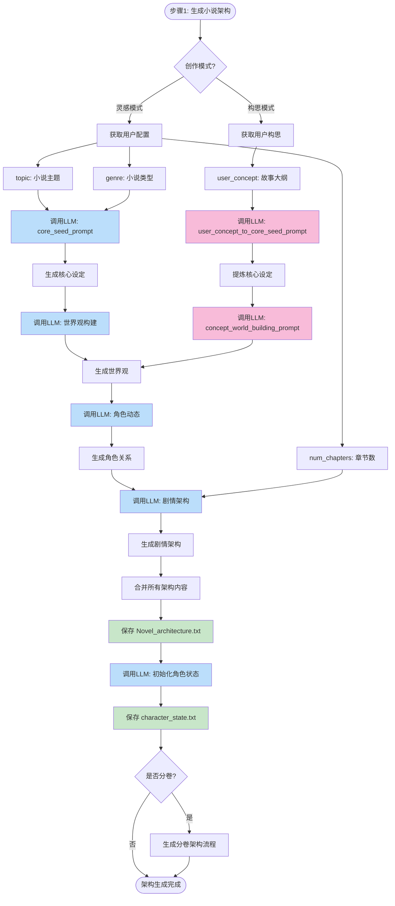
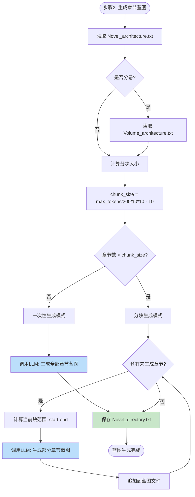
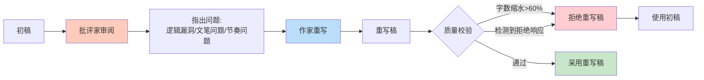
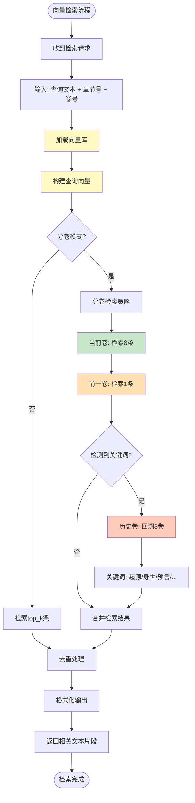
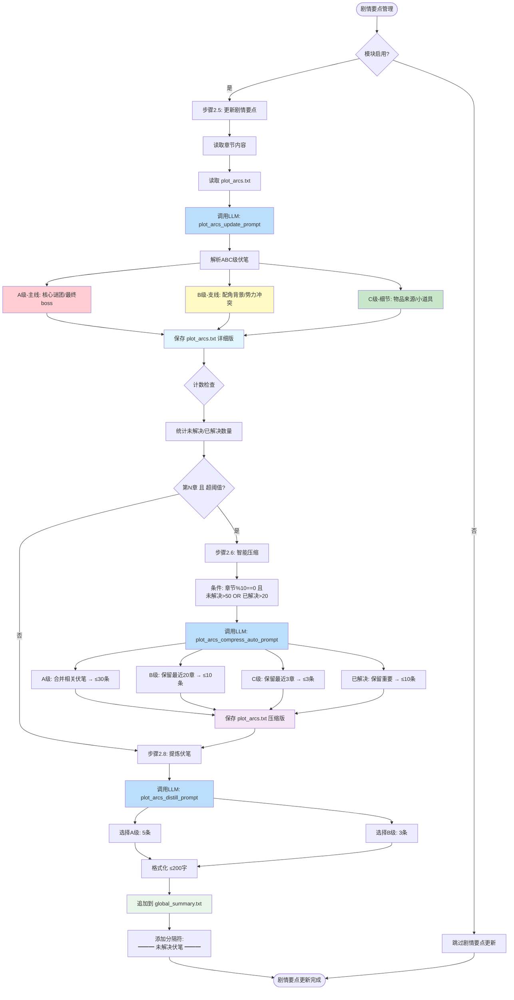

# AutoNovel 小说生成完整流程图

> 本文档详细记录 AutoNovel 从启动到完成一本小说的所有流程环节

---

## 📋 目录

- [1. 整体流程概览](#1-整体流程概览)
- [2. 双创作模式](#2-双创作模式)
- [3. 小说架构生成流程](#3-小说架构生成流程)
- [4. 章节蓝图生成流程](#4-章节蓝图生成流程)
- [5. 章节草稿生成流程](#5-章节草稿生成流程)
- [6. 章节优化三方案 (Plan A/B/C)](#6-章节优化三方案-plan-abc)
- [7. 章节定稿流程（核心）](#7-章节定稿流程核心)
- [8. 分卷模式特殊流程](#8-分卷模式特殊流程)
- [9. 向量检索机制](#9-向量检索机制)
- [10. 文件关系图](#10-文件关系图)
- [11. 剧情要点管理流程](#11-剧情要点管理流程)

---

## 1. 整体流程概览

```mermaid
flowchart TD
    Start([用户启动生成]) --> ConfigCheck{配置检查}
    ConfigCheck -->|配置无效| Error1[显示错误提示]
    ConfigCheck -->|配置有效| ModeCheck{创作模式?}

    ModeCheck -->|灵感模式| Step1A[步骤1: 从主题生成架构]
    ModeCheck -->|构思模式| Step1B[步骤1: 从大纲提炼架构]

    Step1A --> VolumeCheck{是否分卷模式?}
    Step1B --> VolumeCheck
    VolumeCheck -->|是| Step1c[步骤1b: 生成分卷架构]
    VolumeCheck -->|否| Step2
    Step1c --> Step2[步骤2: 生成章节蓝图]

    Step2 --> Step3[步骤3: 生成章节草稿]
    Step3 --> PlanACheck{Plan A启用?}
    PlanACheck -->|是| InjectForeshadow[注入未解决伏笔]
    PlanACheck -->|否| GenerateDraft
    InjectForeshadow --> GenerateDraft[生成章节内容]

    GenerateDraft --> PlanCCheck{Plan C启用?}
    PlanCCheck -->|是| CritiqueLoop[批评家审阅 → 作家重写]
    PlanCCheck -->|否| Step4
    CritiqueLoop --> Step4[步骤4: 定稿章节]

    Step4 --> PlanBCheck{Plan B启用?}
    PlanBCheck -->|是| GenSummary[生成单章摘要缓存]
    PlanBCheck -->|否| UpdateState
    GenSummary --> UpdateState[更新摘要/角色/伏笔]

    UpdateState --> CheckMore{还有章节?}
    CheckMore -->|是| Step3
    CheckMore -->|否| VolumeEndCheck{分卷模式?}

    VolumeEndCheck -->|是| CheckVolume{当前卷结束?}
    CheckVolume -->|是| FinalizeVolume[生成卷摘要]
    CheckVolume -->|否| AllDone
    FinalizeVolume --> CheckMoreVolume{还有下一卷?}
    CheckMoreVolume -->|是| Step3
    CheckMoreVolume -->|否| AllDone

    VolumeEndCheck -->|否| AllDone[完成生成]
    AllDone --> End([小说生成完成])

    style Step1A fill:#e1f5fe
    style Step1B fill:#e1f5fe
    style Step2 fill:#f3e5f5
    style Step3 fill:#fff3e0
    style Step4 fill:#e8f5e9
    style FinalizeVolume fill:#fce4ec
    style InjectForeshadow fill:#ffecb3
    style CritiqueLoop fill:#ffccbc
    style GenSummary fill:#c8e6c9
```



### 流程说明

| 步骤 | 功能 | 输出文件 | 核心模块 |
|------|------|----------|----------|
| **步骤1** | 生成小说架构 | `Novel_architecture.txt`<br>`character_state.txt` | `architecture.py` |
| **步骤1b** | 生成分卷架构（可选） | `Volume_architecture.txt` | `architecture.py` |
| **步骤2** | 生成章节蓝图/目录 | `Novel_directory.txt` | `blueprint.py` |
| **步骤3** | 生成章节草稿 | `chapter_X.txt`<br>`outline_X.txt` | `chapter.py` |
| **Plan A** | 伏笔注入 | 从 `plot_arcs.txt` 提取 | `chapter.py` |
| **Plan C** | 批评家重写 | 优化 `chapter_X.txt` | `chapter.py` |
| **步骤4** | 定稿章节 | 更新 `global_summary.txt`<br>`character_state.txt`<br>`plot_arcs.txt`<br>向量库 | `finalization.py` |
| **Plan B** | 摘要缓存 | `chapter_X_summary.txt` | `finalization.py` |
| **卷结束** | 生成卷摘要 | `volume_X_summary.txt` | `finalization.py` |

### 创作模式说明

| 模式 | 输入 | 特点 | 适用场景 |
|------|------|------|----------|
| **灵感模式** | 主题 + 类型 | AI 从零生成所有设定 | 只有模糊想法 |
| **构思模式** | 用户故事大纲 | 保留用户创意，AI 补充完善 | 已有故事构思 |

---

## 2. 双创作模式


### 模式对比

| 对比项 | 灵感模式 | 构思模式 |
|--------|----------|----------|
| **输入要求** | 主题（如"末日求生"）+ 类型（如"科幻"） | 故事大纲（可详可简） |
| **核心种子** | AI 完全原创 | 从用户构思中提炼 |
| **世界观** | AI 自由发挥 | 基于用户设定补充 |
| **角色设定** | AI 原创设计 | 保留用户角色，补充细节 |
| **剧情架构** | AI 自主规划 | 围绕用户大纲展开 |
| **创意控制** | AI 主导 | 用户主导 |

### 构思模式使用的提示词

1. **user_concept_to_core_seed_prompt**: 从用户构思提炼核心种子
2. **concept_world_building_prompt**: 构思模式世界观补充
3. **concept_character_dynamics_prompt**: 构思模式角色动力学

---

## 3. 小说架构生成流程



### 架构生成使用的提示词

#### 灵感模式
1. **core_seed_prompt**: 生成核心种子设定
2. **world_building_prompt**: 构建世界观
3. **character_dynamics_prompt**: 设计角色动态
4. **plot_architecture_prompt**: 规划剧情架构
5. **create_character_state_prompt**: 初始化角色状态
6. **volume_breakdown_prompt**: 分卷架构设计（分卷模式）

#### 构思模式
1. **user_concept_to_core_seed_prompt**: 从用户构思提炼核心种子
2. **concept_world_building_prompt**: 补充世界观设定
3. **concept_character_dynamics_prompt**: 完善角色动力学
4. **plot_architecture_prompt**: 规划剧情架构（复用）
5. **create_character_state_prompt**: 初始化角色状态（复用）

---

## 4. 章节蓝图生成流程



### 蓝图生成使用的提示词

1. **chapter_blueprint_prompt**: 一次性生成章节蓝图
2. **chunked_chapter_blueprint_prompt**: 分块生成章节蓝图
3. **volume_chapter_blueprint_prompt**: 分卷模式章节蓝图

### 分块逻辑说明

```
chunk_size = (max_tokens / 200 / 10) * 10 - 10

示例:
- max_tokens=4000 → chunk_size=190
- max_tokens=8000 → chunk_size=390
- max_tokens=16000 → chunk_size=790
```

---

## 5. 章节草稿生成流程

```mermaid
flowchart TD
    Start([步骤3: 生成章节草稿]) --> Input[输入章节号 N]
    Input --> ReadBlue[读取 Novel_directory.txt]
    ReadBlue --> Extract[提取第N章大纲]

    Extract --> PlanACheck{Plan A 启用?}
    PlanACheck -->|是| ReadPlotArcs[读取 plot_arcs.txt]
    ReadPlotArcs --> ExtractForeshadow[提取 A级+B级 未解决伏笔]
    ExtractForeshadow --> InjectPrompt[注入生成提示词]
    PlanACheck -->|否| FirstCheck

    InjectPrompt --> FirstCheck{是否第1章?}

    FirstCheck -->|是| ReadArch1[读取 Novel_architecture.txt]
    ReadArch1 --> VectorCheck1{向量库存在?}
    VectorCheck1 -->|是| Vector1[向量检索历史剧情]
    VectorCheck1 -->|否| NoVector1[无历史剧情]
    Vector1 --> LLM1[调用LLM: first_chapter_draft_prompt]
    NoVector1 --> LLM1

    FirstCheck -->|否| ReadArch2[读取 Novel_architecture.txt]
    ReadArch2 --> ReadSummary[读取摘要]

    ReadSummary --> PlanBCheck{Plan B 启用?}
    PlanBCheck -->|是| ReadChapterSummaries[优先读取 chapter_X_summary.txt]
    PlanBCheck -->|否| ReadFullChapters[读取完整章节正文]
    ReadChapterSummaries --> VolumeCheck
    ReadFullChapters --> VolumeCheck

    VolumeCheck{分卷模式?} -->|是| CalcVolume[计算当前卷号]
    CalcVolume --> FirstOfVolume{是卷首章?}
    FirstOfVolume -->|是| ReadPrevVolSummary[读取上一卷摘要]
    FirstOfVolume -->|否| UseSummary
    ReadPrevVolSummary --> UseSummary[组合摘要: 上一卷+本卷累积]

    VolumeCheck -->|否| UseSummary

    UseSummary --> ReadChar[读取 character_state.txt]
    ReadChar --> Vector2[向量检索相关剧情]

    Vector2 --> KeywordCheck{检测到关键词?}
    KeywordCheck -->|是| CrossVolumeSearch[跨卷检索增强]
    KeywordCheck -->|否| NormalSearch[常规检索]

    CrossVolumeSearch --> LLM2[调用LLM: next_chapter_draft_prompt]
    NormalSearch --> LLM2

    LLM1 --> SaveDraft[保存 chapter_N.txt 初稿]
    LLM2 --> SaveDraft

    SaveDraft --> PlanCCheck{Plan C 启用?}
    PlanCCheck -->|是| CritiquePhase[批评家审阅阶段]
    PlanCCheck -->|否| SaveOutline

    CritiquePhase --> LLM3[调用LLM: critique_prompt]
    LLM3 --> CritiqueResult[生成批评意见]
    CritiqueResult --> LLM4[调用LLM: refine_prompt]
    LLM4 --> RefinedDraft[生成重写稿]

    RefinedDraft --> QualityCheck{质量校验}
    QualityCheck -->|通过| UpdateDraft[更新 chapter_N.txt]
    QualityCheck -->|失败| KeepOriginal[保留初稿]

    UpdateDraft --> SaveOutline[保存 outline_N.txt]
    KeepOriginal --> SaveOutline
    SaveOutline --> End([草稿生成完成])

    style LLM1 fill:#bbdefb
    style LLM2 fill:#bbdefb
    style LLM3 fill:#ffccbc
    style LLM4 fill:#ffccbc
    style Vector1 fill:#fff9c4
    style Vector2 fill:#fff9c4
    style CrossVolumeSearch fill:#ffe0b2
    style SaveDraft fill:#c8e6c9
    style ExtractForeshadow fill:#ffecb3
    style ReadChapterSummaries fill:#e8f5e9
```



### 草稿生成使用的提示词

1. **first_chapter_draft_prompt**: 第一章生成
2. **next_chapter_draft_prompt**: 后续章节生成
3. **critique_prompt**: 批评家审阅【Plan C】
4. **refine_prompt**: 作家重写【Plan C】

### Plan A - 伏笔注入

```python
# 伏笔注入逻辑
if plan_a_enabled and os.path.exists("plot_arcs.txt"):
    plot_arcs = read_file("plot_arcs.txt")
    # 提取 A级(主线) 和 B级(支线) 未解决伏笔
    foreshadow_context = extract_active_foreshadowing(plot_arcs)
    # 注入到生成提示词中
    prompt += f"\n\n【未解决伏笔参考】\n{foreshadow_context}"
```

### Plan C - 批评家重写流程



### 向量检索策略

| 场景 | 检索策略 |
|------|----------|
| **第1章** | 无历史剧情，仅依赖架构 |
| **常规章节** | 检索当前卷 + 前一卷（1条） |
| **关键词触发** | 检测到"起源"、"身世"、"预言"等，回溯最多3卷 |
| **分卷模式** | 优先当前卷，补充前一卷，关键词触发历史卷 |

---

## 6. 章节优化三方案 (Plan A/B/C)


### 方案详解

| 方案 | 原理 | 效果 | API成本 | 默认状态 |
|------|------|------|---------|----------|
| **Plan A** | 从 `plot_arcs.txt` 提取伏笔注入提示词 | 剧情连贯，伏笔呼应 | 无额外调用 | ✅ 启用 |
| **Plan B** | 定稿时生成单章摘要，后续读取摘要 | 节省 Token，支持更长篇幅 | +1次/章 | ✅ 启用 |
| **Plan C** | 批评家审阅 + 作家重写 | 质量提升，减少逻辑漏洞 | +2次/章 | ❌ 关闭 |

### 方案组合建议

| 场景 | 推荐组合 | 说明 |
|------|---------|------|
| **快速生成** | Plan A | 基础质量，最低成本 |
| **长篇创作** | Plan A + B | 节省 Token，保持连贯 |
| **精品创作** | Plan A + B + C | 最高质量，成本较高 |

### Plan B 单章摘要示例

```markdown
# chapter_5_summary.txt

【第五章摘要】
主角在古墓中发现了上古遗迹的线索，与神秘老者展开激战。
关键事件：获得残破地图碎片，老者透露"天命者"预言。
角色状态：主角受轻伤，内力有所突破。
伏笔推进：地图指向南疆禁地，老者身份成疑。
```

### Plan C 质量校验规则

```python
def validate_refined_draft(original, refined):
    """校验重写稿质量"""
    # 规则1: 字数不能缩水超过60%
    if len(refined) < len(original) * 0.4:
        return False, "字数缩水过多"

    # 规则2: 检测LLM拒绝响应
    reject_patterns = ["无法", "不能", "抱歉", "我是AI"]
    if any(p in refined[:100] for p in reject_patterns):
        return False, "检测到拒绝响应"

    return True, "通过"
```

---

## 7. 章节定稿流程（核心）

```mermaid
flowchart TD
    Start([步骤4: 定稿章节]) --> Input[输入章节号 N]
    Input --> ReadDraft[读取 chapter_N.txt]

    ReadDraft --> PlanBCheck{Plan B 启用?}
    PlanBCheck -->|是| Step0[🔄 步骤0: 生成单章摘要]
    PlanBCheck -->|否| Step1

    Step0 --> LLM0[调用LLM: single_chapter_summary_prompt]
    LLM0 --> SaveChapterSummary[保存 chapter_N_summary.txt]
    SaveChapterSummary --> Step1

    Step1[🔄 步骤1/3: 更新前文摘要] --> ReadArch[读取 Novel_architecture.txt]
    ReadArch --> ReadSummary[读取 global_summary.txt]
    ReadSummary --> LLM1[调用LLM: summary_prompt]
    LLM1 --> SaveSummary[保存 global_summary.txt]

    SaveSummary --> Step2[🔄 步骤2/3: 更新角色状态]
    Step2 --> ReadChar[读取 character_state.txt]
    ReadChar --> LLM2[调用LLM: update_character_state_prompt]
    LLM2 --> SaveChar[保存 character_state.txt]

    SaveChar --> PlotArcsCheck{剧情要点模块启用?}
    PlotArcsCheck -->|否| Step3
    PlotArcsCheck -->|是| Step25[🔄 步骤2.5/3: 更新剧情要点]

    Step25 --> ReadPlotArcs[读取 plot_arcs.txt]
    ReadPlotArcs --> LLM3[调用LLM: plot_arcs_update_prompt]
    LLM3 --> ParsePlotArcs[解析ABC级伏笔]
    ParsePlotArcs --> SavePlotArcs1[保存 plot_arcs.txt 详细版]

    SavePlotArcs1 --> CompressCheck{每10章 且 超过阈值?}
    CompressCheck -->|是| Step26[🔄 步骤2.6/3: 智能压缩]
    CompressCheck -->|否| Step28

    Step26 --> LLM4[调用LLM: plot_arcs_compress_auto_prompt]
    LLM4 --> CompressRules[压缩规则: A≤30, B≤10, C≤3, 已解决≤10]
    CompressRules --> SavePlotArcs2[保存 plot_arcs.txt 压缩版]

    SavePlotArcs2 --> Step28[🔄 步骤2.8/3: 提炼伏笔]
    Step28 --> LLM5[调用LLM: plot_arcs_distill_prompt]
    LLM5 --> DistillRules[提炼规则: A级5条 + B级3条 ≤200字]
    DistillRules --> AppendSummary[追加到 global_summary.txt]

    AppendSummary --> Step3[🔄 步骤3/3: 插入向量库]
    Step3 --> EmbedCheck{Embedding配置有效?}
    EmbedCheck -->|是| ChunkText[切分章节文本]
    EmbedCheck -->|否| End

    ChunkText --> VolumeMetadata{分卷模式?}
    VolumeMetadata -->|是| AddVolumeMeta[添加卷号元数据]
    VolumeMetadata -->|否| AddChapterMeta[添加章节号元数据]

    AddVolumeMeta --> Vectorize[向量化并存储]
    AddChapterMeta --> Vectorize
    Vectorize --> VolumeEndCheck{卷结束?}

    VolumeEndCheck -->|是| FinalizeVolume[生成卷摘要流程]
    VolumeEndCheck -->|否| End([定稿完成])
    FinalizeVolume --> End

    style LLM0 fill:#e8f5e9
    style LLM1 fill:#bbdefb
    style LLM2 fill:#bbdefb
    style LLM3 fill:#bbdefb
    style LLM4 fill:#bbdefb
    style LLM5 fill:#bbdefb
    style SaveChapterSummary fill:#e8f5e9
    style SaveSummary fill:#c8e6c9
    style SaveChar fill:#c8e6c9
    style SavePlotArcs1 fill:#c8e6c9
    style SavePlotArcs2 fill:#c8e6c9
    style Vectorize fill:#fff9c4
    style FinalizeVolume fill:#fce4ec
```



### 定稿流程详细步骤

| 步骤 | 功能 | LLM调用 | 输出文件 | 模块开关 |
|------|------|---------|----------|----------|
| **0** | 生成单章摘要【Plan B】 | `single_chapter_summary_prompt` | `chapter_N_summary.txt` | ⚙️ 可选 |
| **1/3** | 更新前文摘要 | `summary_prompt` | `global_summary.txt` | ✅ 必需 |
| **2/3** | 更新角色状态 | `update_character_state_prompt` | `character_state.txt` | ✅ 必需 |
| **2.5/3** | 更新剧情要点 | `plot_arcs_update_prompt` | `plot_arcs.txt` | ⚙️ 可选 |
| **2.6/3** | 智能压缩 | `plot_arcs_compress_auto_prompt` | `plot_arcs.txt` | ⚙️ 可选 |
| **2.8/3** | 提炼伏笔 | `plot_arcs_distill_prompt` | `global_summary.txt` | ⚙️ 可选 |
| **3/3** | 插入向量库 | - | `vectorstore/` | ⚙️ 可选 |

### Plan B 单章摘要生成

```python
# Plan B 摘要缓存逻辑
if plan_b_enabled:
    # 生成单章摘要
    summary = llm.invoke(single_chapter_summary_prompt.format(
        chapter_content=chapter_text,
        chapter_num=chapter_num
    ))
    # 保存摘要文件
    save_file(f"chapter_{chapter_num}_summary.txt", summary)

# 后续章节生成时
if os.path.exists(f"chapter_{n}_summary.txt"):
    # 优先读取摘要而非完整章节
    context = read_file(f"chapter_{n}_summary.txt")
else:
    context = read_file(f"chapter_{n}.txt")
```

### 剧情要点压缩触发条件

```python
触发条件:
- 章节号是10的倍数
- 且（未解决伏笔 > 50条 OR 已解决伏笔 > 20条）

压缩规则:
- A级（主线）: ≤ 30条（相关伏笔合并）
- B级（支线）: ≤ 10条（保留最近20章）
- C级（细节）: ≤ 3条（保留最近3章）
- 已解决: ≤ 10条
```

---

## 8. 分卷模式特殊流程

```mermaid
flowchart TD
    Start([分卷模式流程]) --> Step1[步骤1: 生成分卷架构]
    Step1 --> Input[num_chapters + chapters_per_volume]
    Input --> Calc[计算卷数和卷范围]
    Calc --> Example[示例: 100章÷30章/卷=4卷]

    Example --> LLM1[调用LLM: volume_breakdown_prompt]
    LLM1 --> SaveVolArch[保存 Volume_architecture.txt]

    SaveVolArch --> Step2[步骤2: 生成章节蓝图]
    Step2 --> BlueprintLoop{按卷生成蓝图}
    BlueprintLoop --> ExtractVolArch[提取该卷架构]
    ExtractVolArch --> LLM2[调用LLM: volume_chapter_blueprint_prompt]
    LLM2 --> AppendBlueprint[追加到 Novel_directory.txt]

    AppendBlueprint --> MoreVolumes1{还有卷?}
    MoreVolumes1 -->|是| BlueprintLoop
    MoreVolumes1 -->|否| Step3

    Step3[步骤3-4: 生成和定稿章节] --> ChapterLoop{逐章处理}
    ChapterLoop --> VolumeNum[计算当前卷号]
    VolumeNum --> IsFirstOfVolume{是卷首章?}

    IsFirstOfVolume -->|是| ReadPrevVol[读取上一卷摘要]
    IsFirstOfVolume -->|否| ReadCurrVol[读取本卷累积摘要]

    ReadPrevVol --> Combine[组合: 上一卷完整+本卷累积]
    ReadCurrVol --> Combine
    Combine --> GenerateChapter[生成章节]
    GenerateChapter --> FinalizeChapter[定稿章节]

    FinalizeChapter --> IsLastOfVolume{是卷末章?}
    IsLastOfVolume -->|是| FinalizeVolume[生成卷摘要]
    IsLastOfVolume -->|否| MoreChapters

    FinalizeVolume --> ReadAllChapters[读取该卷所有章节]
    ReadAllChapters --> LLM3[调用LLM: volume_summary_prompt]
    LLM3 --> SaveVolSummary[保存 volume_X_summary.txt]

    SaveVolSummary --> VectorizeVolSummary[卷摘要向量化]
    VectorizeVolSummary --> ClearGlobal[清空 global_summary.txt]
    ClearGlobal --> MoreChapters{还有章节?}

    MoreChapters -->|是| ChapterLoop
    MoreChapters -->|否| End([分卷生成完成])

    style LLM1 fill:#bbdefb
    style LLM2 fill:#bbdefb
    style LLM3 fill:#bbdefb
    style SaveVolArch fill:#c8e6c9
    style SaveVolSummary fill:#fce4ec
    style VectorizeVolSummary fill:#fff9c4
```



### 分卷模式关键文件

| 文件 | 说明 | 生成时机 |
|------|------|----------|
| `Volume_architecture.txt` | 所有卷的架构设定 | 步骤1完成后 |
| `volume_1_summary.txt` | 第1卷完整摘要 | 第1卷最后一章定稿后 |
| `volume_2_summary.txt` | 第2卷完整摘要 | 第2卷最后一章定稿后 |
| ... | ... | ... |
| `global_summary.txt` | 当前卷累积摘要 | 每章定稿后更新，卷结束后清空 |

### 摘要传递策略

```python
# 第1卷: 仅使用本卷累积摘要
if volume_num == 1:
    context = global_summary.txt

# 第2卷及以后: 上一卷完整 + 本卷累积
else:
    prev_summary = f"volume_{volume_num-1}_summary.txt"
    curr_summary = "global_summary.txt"
    context = prev_summary + "\n\n" + curr_summary
```

---

## 9. 向量检索机制



### 向量检索配置

| 参数 | 默认值 | 说明 |
|------|--------|------|
| **top_k** | 10 | 检索结果数量 |
| **chunk_size** | 500 | 文本切分大小 |
| **chunk_overlap** | 50 | 切分重叠部分 |
| **current_volume_weight** | 8/10 | 当前卷结果占比 |
| **prev_volume_weight** | 1/10 | 前一卷结果占比 |
| **history_volume_weight** | 1/10 | 历史卷结果占比（关键词触发） |

### 关键词列表

```python
CROSS_VOLUME_KEYWORDS = [
    "起源", "身世", "预言", "命运", "宿命",
    "传说", "遗物", "封印", "禁术", "秘密",
    "真相", "阴谋", "背叛", "复仇", "血脉"
]
```

---

## 10. 文件关系图

```mermaid
graph TD
    subgraph 配置文件
        Config[config.json]
        PromptsConfig[prompts_config.json]
        CustomPrompts[custom_prompts/*.txt]
    end

    subgraph 架构文件
        NovelArch[Novel_architecture.txt]
        VolumeArch[Volume_architecture.txt]
        CharState[character_state.txt]
    end

    subgraph 蓝图文件
        Directory[Novel_directory.txt]
    end

    subgraph 章节文件
        Chapter1[chapter_1.txt]
        Chapter2[chapter_2.txt]
        ChapterN[chapter_N.txt]
        Outline1[outline_1.txt]
        Outline2[outline_2.txt]
        OutlineN[outline_N.txt]
    end

    subgraph 单章摘要文件【Plan B】
        ChapterSummary1[chapter_1_summary.txt]
        ChapterSummary2[chapter_2_summary.txt]
        ChapterSummaryN[chapter_N_summary.txt]
    end

    subgraph 摘要文件
        GlobalSummary[global_summary.txt]
        VolumeSummary1[volume_1_summary.txt]
        VolumeSummary2[volume_2_summary.txt]
        VolumeSummaryN[volume_N_summary.txt]
    end

    subgraph 剧情要点文件
        PlotArcs[plot_arcs.txt]
    end

    subgraph 向量库
        VectorStore[(vectorstore/)]
    end

    Config --> NovelArch
    PromptsConfig --> CustomPrompts

    NovelArch --> VolumeArch
    NovelArch --> CharState
    NovelArch --> Directory

    VolumeArch --> Directory
    Directory --> Chapter1
    Directory --> Chapter2
    Directory --> ChapterN

    Chapter1 --> ChapterSummary1
    Chapter2 --> ChapterSummary2
    ChapterN --> ChapterSummaryN

    Chapter1 --> GlobalSummary
    Chapter2 --> GlobalSummary
    ChapterN --> GlobalSummary

    GlobalSummary --> PlotArcs
    CharState --> PlotArcs

    GlobalSummary --> VolumeSummary1
    GlobalSummary --> VolumeSummary2
    GlobalSummary --> VolumeSummaryN

    Chapter1 --> VectorStore
    Chapter2 --> VectorStore
    ChapterN --> VectorStore
    VolumeSummary1 --> VectorStore
    VolumeSummary2 --> VectorStore
    VolumeSummaryN --> VectorStore

    ChapterSummary1 -.读取.-> Chapter2
    ChapterSummary2 -.读取.-> ChapterN
    VectorStore -.检索.-> Chapter2
    VectorStore -.检索.-> ChapterN

    style Config fill:#e1f5fe
    style PromptsConfig fill:#e1f5fe
    style NovelArch fill:#f3e5f5
    style VolumeArch fill:#fce4ec
    style Directory fill:#fff3e0
    style GlobalSummary fill:#e8f5e9
    style PlotArcs fill:#fff9c4
    style VectorStore fill:#ffccbc
```

### 文件依赖关系

| 源文件 | 目标文件 | 关系类型 |
|--------|----------|----------|
| `config.json` | 所有生成文件 | 配置驱动 |
| `Novel_architecture.txt` | `character_state.txt` | 初始化 |
| `Novel_architecture.txt` | `Volume_architecture.txt` | 分卷规划 |
| `Novel_architecture.txt` | `Novel_directory.txt` | 蓝图生成 |
| `Novel_directory.txt` | `chapter_X.txt` | 章节草稿 |
| `chapter_X.txt` | `chapter_X_summary.txt` | 单章摘要【Plan B】 |
| `chapter_X.txt` | `global_summary.txt` | 摘要累积 |
| `chapter_X.txt` | `character_state.txt` | 状态更新 |
| `chapter_X.txt` | `plot_arcs.txt` | 剧情要点更新 |
| `chapter_X.txt` | `vectorstore/` | 向量化存储 |
| `chapter_X_summary.txt` | 下一章草稿 | 摘要读取【Plan B】 |
| `global_summary.txt` | `volume_X_summary.txt` | 卷摘要生成 |
| `vectorstore/` | 下一章草稿 | 历史检索 |
| `plot_arcs.txt` | 下一章草稿 | 伏笔注入【Plan A】 |

---

## 11. 剧情要点管理流程



### 剧情要点ABC分级系统

| 级别 | 定义 | 示例 | 传递策略 |
|------|------|------|----------|
| **A级-主线** | 直接影响故事核心走向 | 世界观谜团、主角核心秘密、最终boss | 全部传递，压缩≤30条 |
| **B级-支线** | 影响重要配角或次要情节线 | 配角背景、势力冲突 | 最近20章，压缩≤10条 |
| **C级-细节** | 仅影响局部细节 | 物品来源、小道具、一次性角色 | 最近3章，压缩≤3条 |

### 剧情要点压缩规则

```python
# 触发条件
if chapter_num % 10 == 0 and (unsolved > 50 or solved > 20):
    # 执行智能压缩
    compress_plot_arcs()

# 压缩目标
{
    "A级-主线": "≤ 30条（合并相关伏笔）",
    "B级-支线": "≤ 10条（保留最近20章）",
    "C级-细节": "≤ 3条（保留最近3章）",
    "已解决": "≤ 10条（保留重要的）"
}
```

### 剧情要点提炼规则

```python
# 提炼到摘要的规则
distill_rules = {
    "A级": "5条（最重要的主线伏笔）",
    "B级": "3条（最相关的支线伏笔）",
    "总字数": "≤ 200字",
    "格式": "简洁一句话描述"
}

# 输出格式
"""
━━━ 未解决伏笔（至第X章） ━━━
1. [A级-主线] ...
2. [A级-主线] ...
3. [B级-支线] ...
"""
```

### 剧情要点文件结构

```markdown
# plot_arcs.txt 结构

## 📌 未解决伏笔（至第X章）

### A级-主线
- [A级-主线] 主角的真实身份之谜（第3章）
- [A级-主线] 远古遗迹中的预言（第5章）

### B级-支线
- [B级-支线] 二师兄的过往恩怨（第8章）
- [B级-支线] 神秘组织的真正目的（第10章）

### C级-细节
- [C级-细节] 玉佩的来历（第12章）

## ✅ 已解决伏笔

- ✓已解决: 入门考核的真相 → 第15章揭晓
- ✓已解决: 师父的考验目的 → 第18章解答
```

---

## 📊 性能与优化

### LLM调用统计（100章小说）

| 阶段 | LLM调用次数 | 估算tokens | 备注 |
|------|-------------|------------|------|
| **架构生成** | 5-6次 | 10K-20K | 灵感/构思模式 |
| **分卷架构** | 1次（可选） | 2K-5K | 分卷模式 |
| **蓝图生成** | 1-10次（分块） | 20K-50K | |
| **章节草稿** | 100次 | 500K-1M | |
| **Plan C批评家** | 100次（可选） | 100K-200K | 每章+2次 |
| **Plan B摘要** | 100次（可选） | 50K-100K | 每章+1次 |
| **章节定稿** | 500-600次 | 1M-2M | |
| **剧情要点** | 100-110次（含压缩） | 100K-200K | |
| **总计（基础）** | 700-830次 | 1.6M-3.2M | Plan A only |
| **总计（完整）** | 900-1030次 | 1.8M-3.5M | Plan A+B+C |

### 优化建议

1. **向量检索优化**
   - 使用本地Ollama Embedding降低成本
   - 调整chunk_size和top_k平衡精度和速度

2. **分块生成优化**
   - 根据max_tokens自动计算chunk_size
   - 避免单次生成超过模型上下文窗口

3. **剧情要点优化**
   - 启用智能压缩（每10章自动触发）
   - A级≤30条，避免详细版过度膨胀
   - 精简版≤200字，避免压倒主摘要

4. **分卷模式优化**
   - 合理设置chapters_per_volume（建议20-30章）
   - 卷摘要向量化，便于跨卷检索

---

## 🔧 故障排查

### 常见问题

| 问题 | 可能原因 | 解决方法 |
|------|----------|----------|
| **架构生成失败** | API配置错误 | 检查config.json中的api_key和base_url |
| **蓝图超长** | max_tokens过小 | 增加max_tokens或启用分块生成 |
| **向量检索失败** | Embedding配置错误 | 检查embedding_configs，本地模式需启动ollama serve |
| **章节中断** | API超时 | 增加timeout值（默认600s） |
| **伏笔过多** | 压缩未触发 | 检查prompts_config.json中的步骤2.6开关 |
| **摘要过长** | 伏笔提炼未启用 | 启用步骤2.8，限制精简版≤200字 |

### 日志查看

```bash
# 实时查看日志
tail -f logs/app.log

# 搜索错误
grep "ERROR" logs/app.log
```

---

## 📝 总结

### 完整生成流程（100章分卷小说示例）

1. **步骤1**: 生成架构 → `Novel_architecture.txt`、`character_state.txt`
   - 灵感模式：从主题生成
   - 构思模式：从用户大纲提炼
2. **步骤1b**: 生成分卷架构 → `Volume_architecture.txt`（3卷：1-30、31-70、71-100）
3. **步骤2**: 生成蓝图 → `Novel_directory.txt`（100章标题+大纲）
4. **步骤3-4**: 循环100次
   - 【Plan A】注入伏笔 → 读取 `plot_arcs.txt` 中的 A/B 级伏笔
   - 生成草稿 → `chapter_X.txt`、`outline_X.txt`
   - 【Plan C】批评家审阅 + 作家重写（可选）
   - 【Plan B】生成单章摘要 → `chapter_X_summary.txt`（可选）
   - 定稿章节 → 更新 `global_summary.txt`、`character_state.txt`、`plot_arcs.txt`、向量库
   - 第30章: 生成 `volume_1_summary.txt`，清空 `global_summary.txt`
   - 第70章: 生成 `volume_2_summary.txt`，清空 `global_summary.txt`
   - 第100章: 生成 `volume_3_summary.txt`，清空 `global_summary.txt`
5. **完成**: 小说生成完毕，所有文件已保存

### 关键创新点

✅ **双创作模式**: 灵感模式（从主题）+ 构思模式（从大纲），满足不同创作需求
✅ **章节优化三方案**: Plan A 伏笔注入 + Plan B 摘要缓存 + Plan C 批评家重写
✅ **分卷模式**: 支持长篇小说分卷管理，卷摘要自动流转
✅ **向量检索**: 语义检索历史剧情，保证上下文一致性
✅ **剧情要点**: ABC分级管理伏笔，智能压缩+精简传递
✅ **提示词系统**: 模块化提示词管理，支持自定义
✅ **批量生成**: 支持批量草稿+定稿，提升效率

---

**文档版本**: v2.0
**更新时间**: 2025-12-22
**项目地址**: https://github.com/FredericMN/AutoNovel
