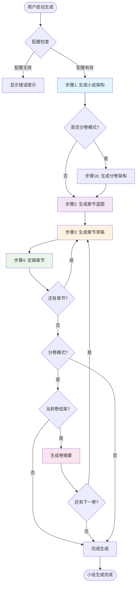
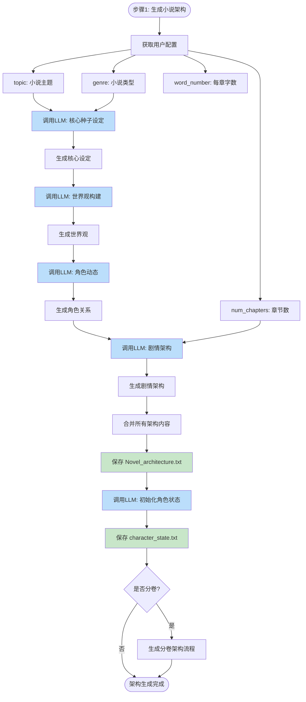
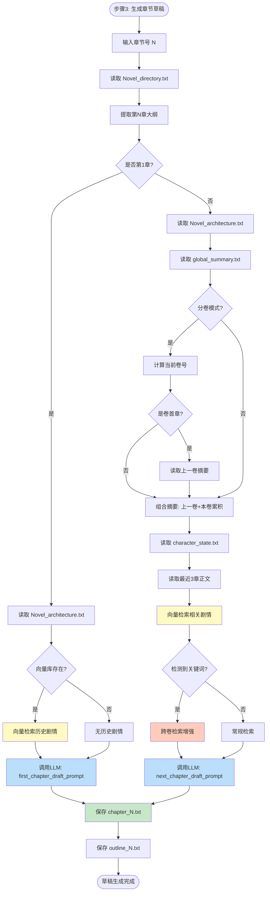
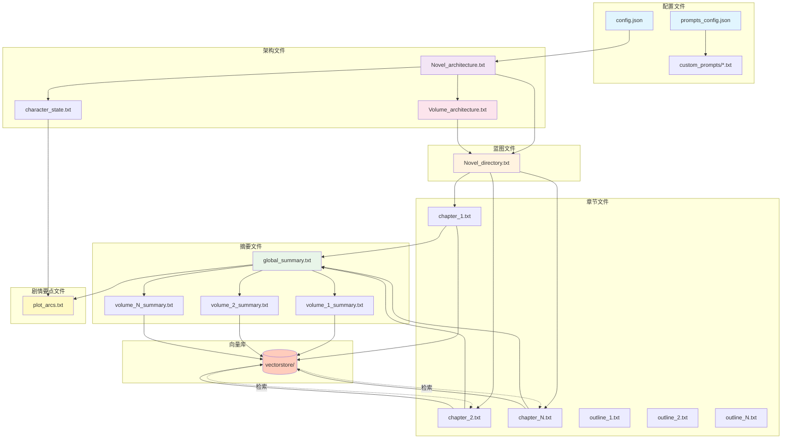

# AutoNovel 小说生成完整流程图

> 本文档详细记录 AutoNovel 从启动到完成一本小说的所有流程环节

---

## 📋 目录

- [1. 整体流程概览](#1-整体流程概览)
- [2. 小说架构生成流程](#2-小说架构生成流程)
- [3. 章节蓝图生成流程](#3-章节蓝图生成流程)
- [4. 章节草稿生成流程](#4-章节草稿生成流程)
- [5. 章节定稿流程（核心）](#5-章节定稿流程核心)
- [6. 分卷模式特殊流程](#6-分卷模式特殊流程)
- [7. 向量检索机制](#7-向量检索机制)
- [8. 文件关系图](#8-文件关系图)
- [9. 剧情要点管理流程](#9-剧情要点管理流程)

---

## 1. 整体流程概览



### 流程说明

| 步骤 | 功能 | 输出文件 | 核心模块 |
|------|------|----------|----------|
| **步骤1** | 生成小说架构 | `Novel_architecture.txt`<br>`character_state.txt` | `architecture.py` |
| **步骤1b** | 生成分卷架构（可选） | `Volume_architecture.txt` | `architecture.py` |
| **步骤2** | 生成章节蓝图/目录 | `Novel_directory.txt` | `blueprint.py` |
| **步骤3** | 生成章节草稿 | `chapter_X.txt`<br>`outline_X.txt` | `chapter.py` |
| **步骤4** | 定稿章节 | 更新 `global_summary.txt`<br>`character_state.txt`<br>`plot_arcs.txt`<br>向量库 | `finalization.py` |
| **卷结束** | 生成卷摘要 | `volume_X_summary.txt` | `finalization.py` |

---

## 2. 小说架构生成流程



### 架构生成使用的提示词

1. **core_seed_prompt**: 生成核心种子设定
2. **world_building_prompt**: 构建世界观
3. **character_dynamics_prompt**: 设计角色动态
4. **plot_architecture_prompt**: 规划剧情架构
5. **create_character_state_prompt**: 初始化角色状态
6. **volume_breakdown_prompt**: 分卷架构设计（分卷模式）

---

## 3. 章节蓝图生成流程


### 蓝图生成使用的提示词

1. **chapter_blueprint_prompt**: 一次性生成章节蓝图
2. **chunked_chapter_blueprint_prompt**: 分块生成章节蓝图
3. **volume_chapter_blueprint_prompt**: 分卷模式章节蓝图

### 分块逻辑说明

```
chunk_size = (max_tokens / 200 / 10) * 10 - 10

示例:
- max_tokens=4000 → chunk_size=190
- max_tokens=8000 → chunk_size=390
- max_tokens=16000 → chunk_size=790
```

---

## 4. 章节草稿生成流程



### 草稿生成使用的提示词

1. **first_chapter_draft_prompt**: 第一章生成
2. **next_chapter_draft_prompt**: 后续章节生成
3. **summarize_recent_chapters_prompt**: 最近章节摘要（可选）

### 向量检索策略

| 场景 | 检索策略 |
|------|----------|
| **第1章** | 无历史剧情，仅依赖架构 |
| **常规章节** | 检索当前卷 + 前一卷（1条） |
| **关键词触发** | 检测到"起源"、"身世"、"预言"等，回溯最多3卷 |
| **分卷模式** | 优先当前卷，补充前一卷，关键词触发历史卷 |

---

## 5. 章节定稿流程（核心）

```mermaid
flowchart TD
    Start([步骤4: 定稿章节]) --> Input[输入章节号 N]
    Input --> ReadDraft[读取 chapter_N.txt]

    ReadDraft --> Step1[🔄 步骤1/3: 更新前文摘要]
    Step1 --> ReadArch[读取 Novel_architecture.txt]
    ReadArch --> ReadSummary[读取 global_summary.txt]
    ReadSummary --> LLM1[调用LLM: summary_prompt]
    LLM1 --> SaveSummary[保存 global_summary.txt]

    SaveSummary --> Step2[🔄 步骤2/3: 更新角色状态]
    Step2 --> ReadChar[读取 character_state.txt]
    ReadChar --> LLM2[调用LLM: update_character_state_prompt]
    LLM2 --> SaveChar[保存 character_state.txt]

    SaveChar --> PlotArcsCheck{剧情要点模块启用?}
    PlotArcsCheck -->|否| Step3
    PlotArcsCheck -->|是| Step25[🔄 步骤2.5/3: 更新剧情要点]

    Step25 --> ReadPlotArcs[读取 plot_arcs.txt]
    ReadPlotArcs --> LLM3[调用LLM: plot_arcs_update_prompt]
    LLM3 --> ParsePlotArcs[解析ABC级伏笔]
    ParsePlotArcs --> SavePlotArcs1[保存 plot_arcs.txt 详细版]

    SavePlotArcs1 --> CompressCheck{每10章 且 超过阈值?}
    CompressCheck -->|是| Step26[🔄 步骤2.6/3: 智能压缩]
    CompressCheck -->|否| Step28

    Step26 --> LLM4[调用LLM: plot_arcs_compress_auto_prompt]
    LLM4 --> CompressRules[压缩规则: A≤30, B≤10, C≤3, 已解决≤10]
    CompressRules --> SavePlotArcs2[保存 plot_arcs.txt 压缩版]

    SavePlotArcs2 --> Step28[🔄 步骤2.8/3: 提炼伏笔]
    Step28 --> LLM5[调用LLM: plot_arcs_distill_prompt]
    LLM5 --> DistillRules[提炼规则: A级5条 + B级3条 ≤200字]
    DistillRules --> AppendSummary[追加到 global_summary.txt]

    AppendSummary --> Step3[🔄 步骤3/3: 插入向量库]
    Step3 --> EmbedCheck{Embedding配置有效?}
    EmbedCheck -->|是| ChunkText[切分章节文本]
    EmbedCheck -->|否| End

    ChunkText --> VolumeMetadata{分卷模式?}
    VolumeMetadata -->|是| AddVolumeMeta[添加卷号元数据]
    VolumeMetadata -->|否| AddChapterMeta[添加章节号元数据]

    AddVolumeMeta --> Vectorize[向量化并存储]
    AddChapterMeta --> Vectorize
    Vectorize --> VolumeEndCheck{卷结束?}

    VolumeEndCheck -->|是| FinalizeVolume[生成卷摘要流程]
    VolumeEndCheck -->|否| End([定稿完成])
    FinalizeVolume --> End

    style LLM1 fill:#bbdefb
    style LLM2 fill:#bbdefb
    style LLM3 fill:#bbdefb
    style LLM4 fill:#bbdefb
    style LLM5 fill:#bbdefb
    style SaveSummary fill:#c8e6c9
    style SaveChar fill:#c8e6c9
    style SavePlotArcs1 fill:#c8e6c9
    style SavePlotArcs2 fill:#c8e6c9
    style Vectorize fill:#fff9c4
    style FinalizeVolume fill:#fce4ec
```



### 定稿流程详细步骤

| 步骤 | 功能 | LLM调用 | 输出文件 | 模块开关 |
|------|------|---------|----------|----------|
| **1/3** | 更新前文摘要 | `summary_prompt` | `global_summary.txt` | ✅ 必需 |
| **2/3** | 更新角色状态 | `update_character_state_prompt` | `character_state.txt` | ✅ 必需 |
| **2.5/3** | 更新剧情要点 | `plot_arcs_update_prompt` | `plot_arcs.txt` | ⚙️ 可选 |
| **2.6/3** | 智能压缩 | `plot_arcs_compress_auto_prompt` | `plot_arcs.txt` | ⚙️ 可选 |
| **2.8/3** | 提炼伏笔 | `plot_arcs_distill_prompt` | `global_summary.txt` | ⚙️ 可选 |
| **3/3** | 插入向量库 | - | `vectorstore/` | ⚙️ 可选 |

### 剧情要点压缩触发条件

```python
触发条件:
- 章节号是10的倍数
- 且（未解决伏笔 > 50条 OR 已解决伏笔 > 20条）

压缩规则:
- A级（主线）: ≤ 30条（相关伏笔合并）
- B级（支线）: ≤ 10条（保留最近20章）
- C级（细节）: ≤ 3条（保留最近3章）
- 已解决: ≤ 10条
```

---

## 6. 分卷模式特殊流程


### 分卷模式关键文件

| 文件 | 说明 | 生成时机 |
|------|------|----------|
| `Volume_architecture.txt` | 所有卷的架构设定 | 步骤1完成后 |
| `volume_1_summary.txt` | 第1卷完整摘要 | 第1卷最后一章定稿后 |
| `volume_2_summary.txt` | 第2卷完整摘要 | 第2卷最后一章定稿后 |
| ... | ... | ... |
| `global_summary.txt` | 当前卷累积摘要 | 每章定稿后更新，卷结束后清空 |

### 摘要传递策略

```python
# 第1卷: 仅使用本卷累积摘要
if volume_num == 1:
    context = global_summary.txt

# 第2卷及以后: 上一卷完整 + 本卷累积
else:
    prev_summary = f"volume_{volume_num-1}_summary.txt"
    curr_summary = "global_summary.txt"
    context = prev_summary + "\n\n" + curr_summary
```

---

## 7. 向量检索机制


### 向量检索配置

| 参数 | 默认值 | 说明 |
|------|--------|------|
| **top_k** | 10 | 检索结果数量 |
| **chunk_size** | 500 | 文本切分大小 |
| **chunk_overlap** | 50 | 切分重叠部分 |
| **current_volume_weight** | 8/10 | 当前卷结果占比 |
| **prev_volume_weight** | 1/10 | 前一卷结果占比 |
| **history_volume_weight** | 1/10 | 历史卷结果占比（关键词触发） |

### 关键词列表

```python
CROSS_VOLUME_KEYWORDS = [
    "起源", "身世", "预言", "命运", "宿命",
    "传说", "遗物", "封印", "禁术", "秘密",
    "真相", "阴谋", "背叛", "复仇", "血脉"
]
```

---

## 8. 文件关系图



### 文件依赖关系

| 源文件 | 目标文件 | 关系类型 |
|--------|----------|----------|
| `config.json` | 所有生成文件 | 配置驱动 |
| `Novel_architecture.txt` | `character_state.txt` | 初始化 |
| `Novel_architecture.txt` | `Volume_architecture.txt` | 分卷规划 |
| `Novel_architecture.txt` | `Novel_directory.txt` | 蓝图生成 |
| `Novel_directory.txt` | `chapter_X.txt` | 章节草稿 |
| `chapter_X.txt` | `global_summary.txt` | 摘要累积 |
| `chapter_X.txt` | `character_state.txt` | 状态更新 |
| `chapter_X.txt` | `plot_arcs.txt` | 剧情要点更新 |
| `chapter_X.txt` | `vectorstore/` | 向量化存储 |
| `global_summary.txt` | `volume_X_summary.txt` | 卷摘要生成 |
| `vectorstore/` | 下一章草稿 | 历史检索 |

---

## 9. 剧情要点管理流程


### 剧情要点ABC分级系统

| 级别 | 定义 | 示例 | 传递策略 |
|------|------|------|----------|
| **A级-主线** | 直接影响故事核心走向 | 世界观谜团、主角核心秘密、最终boss | 全部传递，压缩≤30条 |
| **B级-支线** | 影响重要配角或次要情节线 | 配角背景、势力冲突 | 最近20章，压缩≤10条 |
| **C级-细节** | 仅影响局部细节 | 物品来源、小道具、一次性角色 | 最近3章，压缩≤3条 |

### 剧情要点压缩规则

```python
# 触发条件
if chapter_num % 10 == 0 and (unsolved > 50 or solved > 20):
    # 执行智能压缩
    compress_plot_arcs()

# 压缩目标
{
    "A级-主线": "≤ 30条（合并相关伏笔）",
    "B级-支线": "≤ 10条（保留最近20章）",
    "C级-细节": "≤ 3条（保留最近3章）",
    "已解决": "≤ 10条（保留重要的）"
}
```

### 剧情要点提炼规则

```python
# 提炼到摘要的规则
distill_rules = {
    "A级": "5条（最重要的主线伏笔）",
    "B级": "3条（最相关的支线伏笔）",
    "总字数": "≤ 200字",
    "格式": "简洁一句话描述"
}

# 输出格式
"""
━━━ 未解决伏笔（至第X章） ━━━
1. [A级-主线] ...
2. [A级-主线] ...
3. [B级-支线] ...
"""
```

### 剧情要点文件结构

```markdown
# plot_arcs.txt 结构

## 📌 未解决伏笔（至第X章）

### A级-主线
- [A级-主线] 主角的真实身份之谜（第3章）
- [A级-主线] 远古遗迹中的预言（第5章）

### B级-支线
- [B级-支线] 二师兄的过往恩怨（第8章）
- [B级-支线] 神秘组织的真正目的（第10章）

### C级-细节
- [C级-细节] 玉佩的来历（第12章）

## ✅ 已解决伏笔

- ✓已解决: 入门考核的真相 → 第15章揭晓
- ✓已解决: 师父的考验目的 → 第18章解答
```

---

## 📊 性能与优化

### LLM调用统计（100章小说）

| 阶段 | LLM调用次数 | 估算tokens |
|------|-------------|------------|
| **架构生成** | 5-6次 | 10K-20K |
| **分卷架构** | 1次（可选） | 2K-5K |
| **蓝图生成** | 1-10次（分块） | 20K-50K |
| **章节草稿** | 100次 | 500K-1M |
| **章节定稿** | 500-600次 | 1M-2M |
| **剧情要点** | 100-110次（含压缩） | 100K-200K |
| **总计** | 700-830次 | 1.6M-3.2M |

### 优化建议

1. **向量检索优化**
   - 使用本地Ollama Embedding降低成本
   - 调整chunk_size和top_k平衡精度和速度

2. **分块生成优化**
   - 根据max_tokens自动计算chunk_size
   - 避免单次生成超过模型上下文窗口

3. **剧情要点优化**
   - 启用智能压缩（每10章自动触发）
   - A级≤30条，避免详细版过度膨胀
   - 精简版≤200字，避免压倒主摘要

4. **分卷模式优化**
   - 合理设置chapters_per_volume（建议20-30章）
   - 卷摘要向量化，便于跨卷检索

---

## 🔧 故障排查

### 常见问题

| 问题 | 可能原因 | 解决方法 |
|------|----------|----------|
| **架构生成失败** | API配置错误 | 检查config.json中的api_key和base_url |
| **蓝图超长** | max_tokens过小 | 增加max_tokens或启用分块生成 |
| **向量检索失败** | Embedding配置错误 | 检查embedding_configs，本地模式需启动ollama serve |
| **章节中断** | API超时 | 增加timeout值（默认600s） |
| **伏笔过多** | 压缩未触发 | 检查prompts_config.json中的步骤2.6开关 |
| **摘要过长** | 伏笔提炼未启用 | 启用步骤2.8，限制精简版≤200字 |

### 日志查看

```bash
# 实时查看日志
tail -f logs/app.log

# 搜索错误
grep "ERROR" logs/app.log
```

---

## 📝 总结

### 完整生成流程（100章分卷小说示例）

1. **步骤1**: 生成架构 → `Novel_architecture.txt`、`character_state.txt`
2. **步骤1b**: 生成分卷架构 → `Volume_architecture.txt`（3卷：1-30、31-70、71-100）
3. **步骤2**: 生成蓝图 → `Novel_directory.txt`（100章标题+大纲）
4. **步骤3-4**: 循环100次
   - 生成草稿 → `chapter_X.txt`、`outline_X.txt`
   - 定稿章节 → 更新 `global_summary.txt`、`character_state.txt`、`plot_arcs.txt`、向量库
   - 第30章: 生成 `volume_1_summary.txt`，清空 `global_summary.txt`
   - 第70章: 生成 `volume_2_summary.txt`，清空 `global_summary.txt`
   - 第100章: 生成 `volume_3_summary.txt`，清空 `global_summary.txt`
5. **完成**: 小说生成完毕，所有文件已保存

### 关键创新点

✅ **分卷模式**: 支持长篇小说分卷管理，卷摘要自动流转
✅ **向量检索**: 语义检索历史剧情，保证上下文一致性
✅ **剧情要点**: ABC分级管理伏笔，智能压缩+精简传递
✅ **提示词系统**: 模块化提示词管理，支持自定义
✅ **批量生成**: 支持批量草稿+定稿，提升效率

---

**文档版本**: v1.0
**生成时间**: 2025-10-03
**项目地址**: D:\project\AutoNovel
